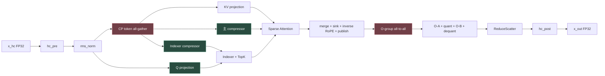
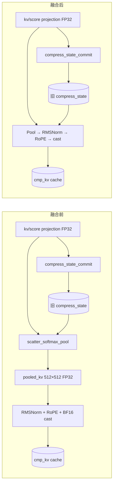

# `_jit_l3_decode_csa_20260903_010617` 融合推荐报告

## 1. 分析范围与结论

本报告针对 `decode_csa.py` 及 `_jit_l3_decode_csa_20260903_010617` 中的编译、依赖和运行产物进行融合分析。原始源码与 JIT 目录没有被修改。

结论按证据强度分为三类：

- **产物事实**：直接来自 `kernel_config.py`、`deps.json`、swimlane、host log 或 `perf_hints.log`。
- **源码事实**：直接来自算子实现中的数据依赖、精度顺序和状态更新约束。
- **候选推断**：尚未重新编译或在设备上 A/B 测量的融合方案，不作为已实现收益。

当前最值得进入实现验证的融合边界是：

1. **CSA-FUS-01：主压缩器 Pool + RMSNorm + RoPE + Cache Write**，建议优先验证。
2. **CSA-FUS-02：Q Projection Cube→Vector 分块流水**，条件推荐；在 A2/A3 上保留 GM 交接语义。
3. **CSA-FUS-03：Indexer 内压缩器 Pool + RMSNorm**，建议作为同类模板的第二个实验。
4. **CSA-FUS-04：ReduceScatter Reduce + HC Post**，暂缓；Buffer 压力与同步协议风险高。

在任何融合实验前，应先处理两处明显的 rank 等待偏斜：rank 0 的 `cp_token_allgather_payload_wait` 为 **1082.22 µs**，rank 1 为 **22.80 µs**；rank 0 的 `o_group_a2a_wait` 为 **663.56 µs**，rank 1 为 **2.14 µs**。这两处不是普通算子融合能够直接消除的问题。

## 2. 输入与产物证据

### 2.1 工作负载

- 目标平台：`a2a3`。
- Runtime：`tensormap_and_ringbuffer`。
- 本次程序默认 TP：2。
- Decode batch：64，speculative sequence：8。
- 每 rank 请求数：32；每 rank token 数：256；TP group KV token 数：512。
- Hidden：4096；Q heads：64；head dim：512；Indexer heads：64；Indexer head dim：128。

### 2.2 编译图规模

- 64 个 kernel function id。
- 86 个 task 节点，其中 2 个为 control/dummy；swimlane 记录到 84 个 task group。
- 138 个 tensor，338 条依赖边。
- 依赖来源：153 条 creator、149 条 tensormap、36 条 explicit。
- 338 条边都带 `wait`，其中 189 条同时带 `retain`。

这说明当前实现已经大量依赖自动数据依赖和 TensorMap 生命周期。删除边或合并 scope 时，必须同时验证任务先后顺序与 Buffer 保留周期。

### 2.3 运行窗口

- rank 0 core trace 窗口：**4826.36 µs**。
- rank 1 core trace 窗口：**3754.72 µs**。
- 第二次 host 运行记录中的 device wall：rank 0 约 **5.133 ms**，rank 1 约 **4.017 ms**。

这些数值来自单次留存 trace，用于定位候选，不能代替多轮 P50/P95 性能结论。

### 2.4 编译器提示

- `PH001 TileInnermostDimGranularity`：197 条。
- `PH-MR-001 MemoryReuse`：33 条。
- 多个 pipeline 请求 depth 2 或 4，但实际只能容纳 1 个 stage，导致阶段共享存储并串行化。
- `decode_csa.py` 的 RoPE 预处理存在 64 B、256 B 等小于 a2a3 512 B 建议粒度的访问。

## 3. 当前数据流与瓶颈位置



当前长耗时任务包括：

- `csa_merge_pack_publish`：rank 0 span 1074.92 µs，rank 1 span 1144.46 µs。
- `qk_pv_aiv`：rank 0 span 887.34 µs，rank 1 span 949.96 µs。
- `kv_score_proj`：rank 0 span 774.02 µs，rank 1 span 1163.70 µs。
- `csa_rope_interleave`：约 264 µs/rank。

这些是 task 的首尾覆盖时间，不等同于可直接相加的关键路径贡献。

## 4. CSA-FUS-01：主压缩器 Vector 尾链

**结论：推荐验证，优先级最高。**

### 4.1 具体融合什么

融合以下两个 AIV task：

```text
scatter_softmax_pool
  + rmsnorm_rope_cache_write
  → csa_pool_norm_rope_cache_write
```

保留在融合边界外：

- `kv_score_proj`：AIC 双投影，保持 Cube 边界。
- `compress_state_commit`：继续作为独立 AIV task。
- `cmp_kv` 持久 Cache 与映射表：保持外部状态边界。

### 4.2 融合前后数据流



关键变化是 `pooled_kv` 不再作为跨 task 的 GM 中间值。依赖产物显示它的实际边界形状为 `[512, 512] FP32`，逻辑容量 **1 MiB/rank**。若当前生成代码确实完成一次写回和一次重读，候选最多减少 **2 MiB/rank** 的逻辑中间值搬运；这不是已测 HBM 流量。

### 4.3 Buffer 生命周期

```text
融合前
projection buffers ───────────────┬─────────────── commit 完成
old state          ───── pool ────┘
pooled_kv                 [生产]────────[RMS/RoPE 消费]
normed tile                              [计算]──[cache write]

融合后
projection buffers ───────────────┬─────────────── commit 完成
old state          ───── pool ────┘
pooled tile                [生产→RMS→RoPE→cast→cache write]
                           └─ tile 内结束即可复用
```

- 全量 `pooled_kv` 生命周期变为 request/token tile 生命周期。
- 单个 512 维 FP32 pooled row 为 2 KiB；按 8 token/request 同时保留时为 16 KiB，再加归约、RoPE 和搬出临时槽。
- `compress_state` 是持久状态，不能进入临时槽复用池。
- 融合前后的 Cache 写入完成事件必须继续作为下游 Attention 的可见性边界。

### 4.4 调度与同步变化

```text
融合前  AIC projection ──▶ AIV pool ──▶ AIV norm/rope/cache
                                   └──▶ AIV state commit（可与 norm 分支重叠）

融合后  AIC projection ──▶ AIV pool+norm+rope/cache
                                   └──▶ AIV state commit（仍独立）
```

- rank 0 中 pool 与 norm/cache 的观察 span 分别为 174.26 µs 和 40.42 µs；rank 1 为 82.78 µs 和 55.84 µs。
- 融合可删除一个 task 边界并避免 pooled tensor 的跨 task 生命周期。
- `compress_state_commit` 当前与 norm/cache 分支可以重叠。把它一起吞入会延迟 cache-ready，因此不建议扩大到三任务融合。

### 4.5 必须保持的语义

- Pool 必须先读取旧 state，并完成当前 step 的全部 pool，再提交新 state。
- `(position + 1) % 4 == 0` 的边界判断保持不变。
- online softmax 的 `mi/li/oi` 更新顺序保持不变。
- RMSNorm、RoPE、BF16 `rint` 的顺序保持不变。
- `cmp_slot_mapping < 0` 时不得写 Cache。

## 5. CSA-FUS-02：Q Projection Cube→Vector 分块流水

**结论：条件推荐。目标是流水和缩短 Buffer 生命周期，不宣称在 A2/A3 上消除 GM 交接。**

### 5.1 具体融合什么

```text
qproj_matmul (AIC)
  + qproj_dequant_rms_nope_rope (AIV)
  → qproj_cube_vector_pipeline
```

融合任务内部仍保留两个执行阶段：

1. AIC 生成 INT32 accumulator tile。
2. AIV 按 head 执行 dequant、RMSNorm、NOPE 拼接、RoPE 和 BF16 `rint`。

### 5.2 数据流与 Buffer

当前跨 task 中间值为 `[256, 32768] INT32`，逻辑容量 **32 MiB/rank**。

```text
融合前：AIC ──写完整 32 MiB q_proj_i32──▶ GM ──AIV 读取──▶ q BF16

候选：AIC tile ──▶ 有界 GM ring slot ──event──▶ AIV tile ──▶ q BF16
                  slot 0 / slot 1 循环复用
```

- 当前 AIC tile 为 `64 × 512 × INT32`，每个 tile 128 KiB。
- 两槽流水的单 lane 基础容量为 256 KiB；实际总容量取决于同时在途的 N tile 数，必须由调度器设置上限。
- A2/A3 上不能凭源码假设 L0C 直接送入 Vector UB，因此候选默认仍经过 GM ring。
- 预期收益主要来自 AIC/AIV 重叠和不再持有完整 32 MiB accumulator，而不是默认减少 64 MiB 读写。

### 5.3 调度证据

- rank 0：`qproj_matmul` 408.14–535.10 µs，epilogue 541.28–703.46 µs，当前基本串行。
- rank 1：`qproj_matmul` 374.70–636.48 µs，epilogue 644.58–802.48 µs，当前基本串行。
- 候选应让 AIV 在首批 head tile 就绪后启动，而不是等待完整 INT32 Tensor。

### 5.4 风险门禁

- `qkv_proj_rope.py:375` 已出现 Right 空间 pipeline stage 无法全部容纳的提示。先限制 in-flight tile，再尝试 depth 2。
- 每个 head 的平方和归约完成前，不能提前输出归一化结果。
- `qr_scale`、weight scale、gamma、RoPE cos/sin 和 swap index 必须与对应 token/head tile 对齐。
- 仍需产出完整 `q BF16`，因为下游 Sparse Attention 使用它；不能把 Attention 一起并入本候选。

## 6. CSA-FUS-03：Indexer 内压缩器 Pool + RMSNorm

**结论：推荐作为 CSA-FUS-01 的同构小规模实验。**

### 6.1 融合边界

```text
scatter_softmax_pool_0
  + rmsnorm_rope
  → indexer_pool_norm_rope
```

保留：

- `compress_state_commit_0` 独立提交状态。
- `kv_hadamard` 保持 AIC 边界。
- `kv_and_cache_write` 保持 quant 与持久 Cache 写入边界。

### 6.2 搬运与调度变化

- 跨 task pooled tensor 为 `[512, 128] FP32`，容量 256 KiB/rank。
- 条件上限为减少一次写回和一次读取，即 **512 KiB/rank** 逻辑搬运。
- rank 0 两段观察 span 为 49.70 µs 与 33.32 µs；rank 1 为 78.86 µs 与 37.00 µs。
- 融合后仍必须向 `kv_hadamard` 输出 BF16 `[512,128]`，因此只消除 Pool 与 RMSNorm/RoPE 之间的 FP32 中间值。

## 7. CSA-FUS-04：ReduceScatter Reduce + HC Post

**结论：暂缓，不作为首轮实现。**

理论边界为：

```text
tp_o_rs_reduce
  + hc_post
  → reduce_hc_post_epilogue
```

它可以尝试避免 `[256,4096] BF16` 的 `attn_out` 跨 task 物化，条件上限是减少 2 MiB 写回和 2 MiB 重读。但当前不建议立即实现：

- `hc_post` 的多个 pipeline group 请求 depth 4，实际只容纳 1 stage，已有明确的 Vec Buffer 过订阅提示。
- 融合必须在 tile 内保留 **FP32 reduce → BF16 rint → FP32 cast** 的原始舍入边界。
- `tp_o_rs_complete` 负责跨 rank 完成、等待和 signal reset，不能因融合被删除或提前。
- HC post 还要读取 16 MiB/rank 的 FP32 residual stream，并生成 16 MiB/rank 的 `x_out`；扩大边界可能延长 ReduceScatter window 的占用。

只有在缩小 HC tile、解决 pipeline stage 退化并证明 signal 生命周期不变后，才值得进入 A/B 编译。

## 8. 已融合或不建议继续扩大的边界

### 8.1 已有覆盖

- `qproj_dequant_rms_nope_rope` 已把 dequant、RMSNorm、NOPE、RoPE 和 BF16 cast 合为一个 AIV task。
- `rmsnorm_rope_cache_write` 已把主压缩器 RMSNorm、RoPE、cast 与 Cache 写入合并。
- `csa_merge_pack_publish` 已把 online merge、sink 分母、inverse RoPE、BF16 cast、pack、远端 put 与 notify 放入同一任务。
- `kv_score_proj` 已在同一个 AIC tile 中计算 KV projection 和 score projection，共享输入加载。

### 8.2 当前拒绝

- **不把 `compress_state_commit` 并入 Pool**：源码明确要求所有 Pool 完成后才提交，避免后 token 覆盖前 token 所需的旧 ring row。
- **不把 `qk_pv` 与 `csa_merge_pack_publish` 做整块融合**：两者当前已出现执行重叠；publish 自身超过 1 ms，并在 `decode_csa.py:397` 出现 pipeline depth 2 退化到 1 的 Buffer 提示。
- **不把 CP all-gather 的 wait/readback/retire 简单折叠为一个 Kernel**：这些任务承担跨 rank 协议和 window 生命周期，rank 偏斜应先按信号与调度问题诊断。
- **不把所有 RoPE prepare 内联进各消费者**：预计算结果被多个分支复用，内联会复制 gather、cast 和索引生成工作。

## 9. 先于融合的调度修复

### 9.1 CP all-gather 偏斜

```text
rank 0: push 48.02 µs → payload wait 1082.22 µs → readback 13.14 µs
rank 1: push 46.86 µs → payload wait   22.80 µs → readback 75.20 µs
```

`rms_norm` 与 `cp_token_allgather_push` 已经存在约 20 µs 的执行重叠，因此继续把两者机械合并不一定解决长等待。应先检查：

- 两个 rank 的 notify expected value 与实际 worker 完成数；
- rank 0 是否等待尚未 dispatch 的 peer task；
- window row 所有权和 `group_base/tp_rank` 映射；
- scheduler thread/core 绑定造成的发射偏斜；
- 同一轮 signal 是否在 retire 前被下一轮复用。

### 9.2 O-group all-to-all 偏斜

```text
rank 0: merge/publish 完成 3729.66 µs → wait 到 4395.60 µs
rank 1: merge/publish 完成 3293.96 µs → wait 到 3298.44 µs
```

rank 0 的 663.56 µs wait 很可能与 peer publish 到达、任务起点偏斜或 signal 计数有关。该问题解决前，后续 O projection 融合的端到端收益会难以观察。

## 10. 验证方案

### 10.1 编译门禁

每个候选单独生成一份 JIT 产物，并比较：

- kernel function 数、task 数、edge 数；
- `MemoryReuse` 与 `AllocateMemoryAddr` 后的物理地址和 live range；
- pipeline depth 是否仍退化为 1；
- 小于 512 B 的主路径 load/store 是否减少；
- 是否新增全图 barrier、retain edge 或 signal wait。

### 10.2 数值门禁

必须对比：

- `x_out`；
- `compress_state`、`inner_compress_state`；
- `kv_cache`、`cmp_kv`；
- `idx_kv_cache`、`idx_kv_scale`。

覆盖样例：

- ratio-4 边界前后；
- ring wrap-around；
- slot mapping 为 `-1`；
- 不同 start position；
- TP=1/2/4；
- local token 小于、等于当前 256 上限的动态形状。

可沿用源码已有比较阈值：state 的 atol/rtol 为 `1e-3`，BF16 cache 的 atol 为 `1e-4`、rtol 为 `1/128`，INT8 cache 允许的错误比例为 1%。`x_out` 使用源码中的 ratio/hard-cap 规则。

当前自动生成的 `debug/run.py` 中 `_user_compare` 直接返回，因此这份留存 JIT replay **不能证明数值验证已经通过**。重新测试应使用 `decode_csa.py` 的 golden 路径或补齐 debug compare。

### 10.3 性能门禁

- 固定相同输入、start position、TP、设备和编译选项。
- 分别采集 warm-up 后不少于 30 次的 device wall、rank wall、P50/P95。
- 同时比较 task span、AIC/AIV 重叠、data-wait、core-wait 和 signal wait。
- CSA-FUS-01 必须证明 pooled 中间值不再跨 task 物化。
- CSA-FUS-02 必须证明 AIC/AIV tile 出现实际重叠，并且 GM ring 没有扩张为完整 accumulator。
- 若端到端收益小于测量噪声或引入更长 rank wait，候选应回退。

## 11. 证据入口

- 源码：`Data/DeepseekV4/deepseek_v4_flash_dspark/decode_csa.py`
- 主压缩器：`Data/DeepseekV4/deepseek_v4_flash_dspark/decode_compressor_ratio4.py`
- Q 投影：`Data/DeepseekV4/deepseek_v4_flash_dspark/qkv_proj_rope.py`
- 输出投影：`Data/DeepseekV4/deepseek_v4_flash_dspark/decode_o_proj.py`
- HC post：`Data/DeepseekV4/deepseek_v4_flash_dspark/hc_post.py`
- Kernel 清单：`Data/DeepseekV4/_jit_l3_decode_csa_20260903_010617/next_levels/decode_csa_test/kernel_config.py`
- 依赖图：`Data/DeepseekV4/_jit_l3_decode_csa_20260903_010617/dfx_outputs/rank0/d0/deps.json`
- 运行泳道：`Data/DeepseekV4/_jit_l3_decode_csa_20260903_010617/dfx_outputs/rank0/d0/merged_swimlane_20260903_010746.json`
- 编译提示：`Data/DeepseekV4/_jit_l3_decode_csa_20260903_010617/report/perf_hints.log`

