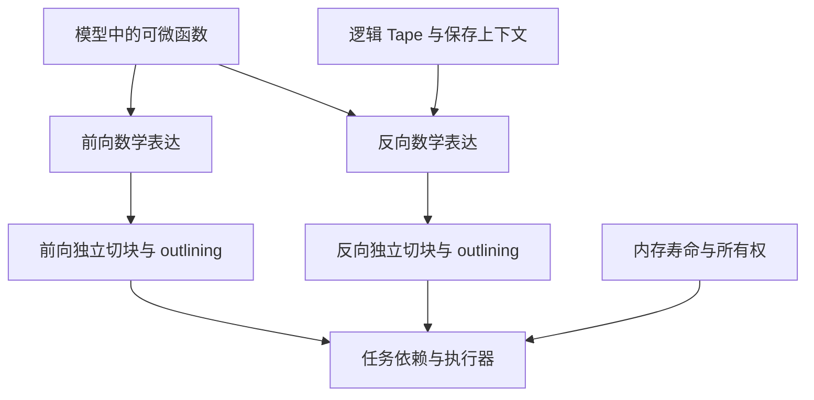
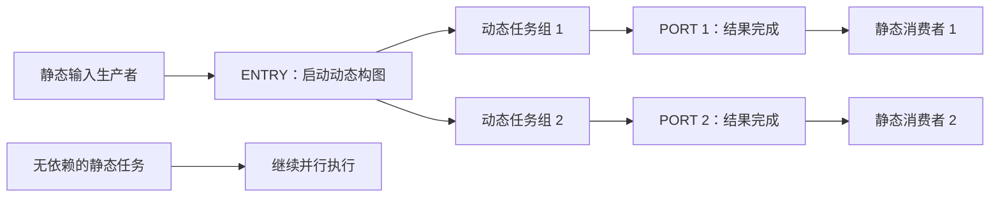

# PyPTO Training 中文深度解析报告

**从自动求导、训练内存到静态回放与去中心化执行**

> 分析日期：2026-09-15  
> 主要读者：PyPTO 产品与架构团队、编译器和运行时开发者、训练能力规划人员。  
> 原文：[pypto_training.md](https://github.com/hw-native-sys/pypto_top_level_documents/blob/main/pypto_training.md)。  
> 固定分析版本：[31bbf531444e399f256b298ff5804d3e58ee86ce](https://github.com/hw-native-sys/pypto_top_level_documents/blob/31bbf531444e399f256b298ff5804d3e58ee86ce/pypto_training.md)，2,901 行，326,300 字节。该仓库提交时间为 2026-08-11 18:47:32（UTC+8）；这不是本文档的首次发布日期。  
> 分析范围：六个 Part、§1—§72 及附录 A。全文读取，并交叉检查三份关联设计文档、PyTorch 官方说明与 Megatron-LM 实现；对部分数学问题做独立 CPU 数值验证。没有编译或运行 PyPTO，没有执行昇腾真机及分布式性能测试。

---

## 0. 执行摘要

### 0.1 一句话理解

这份文档提出了一条完整的架构演进路线：**在逻辑函数层定义训练语义，让编译器独立生成前向和反向任务；按数据寿命管理内存；再通过任务图回放和分布式调度逐步降低编排成本。**

它的范围明显大于标题中的“Training”。前四部分解决训练功能，后两部分解决训练和推理共同面对的运行时效率问题。Part 6 已经涉及硬件同步、常驻内核和计算核控制能力，应当作为独立研究方向评估。

### 0.2 五个核心判断

1. **最有价值的决策是抽象层分离。** 数学求导单元、硬件切块单元和运行时调度单元各有职责。前向与反向不需要按 InCore 一一匹配，这是后续设计成立的基础。
2. **训练新增的核心负担是跨阶段状态。** 反向需要的前向值、跨微批累积的梯度、跨 step 存活的优化器状态，具有不同的所有权和释放条件。训练能力很大程度上是一项生命周期工程。
3. **SAVED 栈与双端 arena 是可研究的分配策略，但不能当作普适定理。** 异步完成、共享保存值、流水线和重计算都会改变峰值与释放顺序；必须用实际时间线验证。
4. **Part 5 是较清晰的增量优化路线。** 它复用执行器，把重复发现依赖的工作转为可缓存产物。不过，图相同不等于回放一定正确，静态内存复用和动态出口还需要严格协议。
5. **Part 6 的收益依赖硬件和负载实测。** 它把集中调度成本分散给工作核，同时引入队列、原子操作、版本管理和终止检测。不能据此承诺“无调度成本”“结果天然确定”或“已有代码几乎直接迁移”。

### 0.3 如何使用本文

- 理解总体方向：读第 1—2 章及第 11 章。
- 评审训练实现：读第 3—6 章及第 9 章。
- 评审编排优化：读第 7—8 章。
- 制定交付计划：读第 10—11 章。

**证据标记：**“原文方案”表示文档提出的设计；“解析”表示本报告的解释或推导；“核查发现”表示可定位的矛盾、反例或缺失条件；“建议”表示后续工程选择。它们都不自动等同于现有产品能力。

---

## 1. 文档定位：六部分构成三条工作线

| 工作线 | 原文范围 | 核心问题 | 预期产物 |
| --- | --- | --- | --- |
| 训练语义与执行 | Part 1—4，§1—45 | 怎样得到正确梯度，保存哪些数据，如何扩展到多设备？ | DSL、求导规则、训练内存、优化器、分布式契约 |
| 编排缓存与回放 | Part 5，§46—63 | 同一批依赖为何每轮都重新构建？ | 可重定位任务计划、guard、缓存、动态子图协议 |
| 去中心化执行 | Part 6，§64—72 | 取消重复构图后，单一调度器是否仍限制吞吐？ | 依赖函数、常驻 worker、窃取队列、跨核同步机制 |

原文开头目录只列四部分，§45 也以“四部分总结”收束，后面继续增加 Part 5、Part 6。这说明它更适合作为持续扩展的架构讨论稿阅读。按章节顺序读，容易把后续研究方向误认为训练首版的必选范围。[原文目录与结论](https://github.com/hw-native-sys/pypto_top_level_documents/blob/31bbf531444e399f256b298ff5804d3e58ee86ce/pypto_training.md#L1-L16)

### 1.1 关联文档暴露出的成熟度边界

交叉检查发现，同版本的背景材料并不支持把所有依赖都视作已交付：

| 关联材料 | 可核实的原文状态 | 对训练方案的影响 |
| --- | --- | --- |
| `sharded_tensor.md` | 明确标为 experimental、供设计评审，后续再跟踪实现 | Part 4 的类型与分布式接口至少有一部分建立在待定设计上 |
| `multi_level_runtime_ring_and_pypto_free_api.md` §13 | 把单一全局 ring 写为现状，多层 ring stack 写为目标架构 | 训练文档把多层 ring 作为既有基础，二者需要版本对齐 |
| `machine_hierarchy_and_function_hierarchy.md` §2.1 | 描述当前运行时支持 Level 0、Level 2，其他层级标签为未来预留 | 编译器能标注层级，不等于运行时已支持完整多层调度 |

来源：[分片张量状态](https://github.com/hw-native-sys/pypto_top_level_documents/blob/31bbf531444e399f256b298ff5804d3e58ee86ce/sharded_tensor.md#L1-L7)、[多层 ring 目标](https://github.com/hw-native-sys/pypto_top_level_documents/blob/31bbf531444e399f256b298ff5804d3e58ee86ce/multi_level_runtime_ring_and_pypto_free_api.md#L188-L222)、[层级支持范围](https://github.com/hw-native-sys/pypto_top_level_documents/blob/31bbf531444e399f256b298ff5804d3e58ee86ce/machine_hierarchy_and_function_hierarchy.md#L90-L101)。

**解析：**这证明文档之间存在状态表述差异，不能仅据此断言代码一定缺失。正式立项前应建立“设计条款—实现仓库—提交版本—测试用例”的对应表。

---

## 2. 总体架构：先分清三个层次、两类图、两种 AOT

### 2.1 三个层次

| 层次 | 应回答的问题 | 示例 |
| --- | --- | --- |
| 逻辑数学层 | 这个函数如何求导，需要保留什么？ | Linear、RMSNorm、FlashAttention |
| 编译与切块层 | 怎样让计算适合片上存储与计算资源？ | `auto_chunk`、InCore outlining |
| 运行时层 | 哪个任务可以执行，哪个缓冲区可以复用？ | tensormap、就绪队列、完成计数、ring |



这是逻辑关系图，不表示现有实现已完成这些模块。[原文 §2—§8](https://github.com/hw-native-sys/pypto_top_level_documents/blob/31bbf531444e399f256b298ff5804d3e58ee86ce/pypto_training.md#L44-L568)

### 2.2 两类图不能互相替代

- **求导图（Tape / grad_fn）**记录函数调用、反向规则和保存的上下文，用来决定要执行什么反向数学。
- **任务依赖图**记录具体任务之间的数据和访问顺序，用来决定何时运行、何时释放资源。

例如，一个 FlashAttention 函数可能展开成很多 InCore 任务，但它在逻辑 Tape 中仍可以只有一个节点。把前向任务依赖边倒过来，并不会凭空产生正确的反向公式。

**容易混淆的一点：**两层都出现 fan-in、fan-out，并不表示两层的节点数、边数和计数器可以直接共用。第 3.4 节给出反例。

### 2.3 两种 AOT 优化不同成本

| 比较 | 求导层 AOT：§8.7 | 编排层 capture/replay：Part 5 |
| --- | --- | --- |
| 主要处理对象 | 前向与反向的数学计算图 | 已实现的任务提交流、依赖和地址绑定 |
| 主要收益 | 求导图优化、保存/重算选择、内存规划 | 减少每轮 tensormap 查询、分配和 wiring |
| 是否自动改善反向公式 | 可能，通过编译优化 | 不自动改善，只回放既有计算 |
| 是否保留运行时任务调度 | 需要后端执行 | 原方案明确保留执行器 |

首次真实运行后捕获计划属于运行时特化。原文把这条路线也纳入 AOT，需要与“运行前完成的编译”区分。**能重放一条任务流，不代表已经得到联合前向/反向图的全部优化收益。**[原文 §8.7、Part 5 范围说明](https://github.com/hw-native-sys/pypto_top_level_documents/blob/31bbf531444e399f256b298ff5804d3e58ee86ce/pypto_training.md#L1564-L1568)

---

## 3. Part 1：自动求导应该定义在哪里

### 3.1 为什么前向和反向 InCore 不能强制一一配对

以矩阵乘法为例：

```text
C = A @ B
A: [M,K]，B: [K,N]，C: [M,N]

dA = dC @ Bᵀ   → 输出 [M,K]，归约维为 N
dB = Aᵀ @ dC   → 输出 [K,N]，归约维为 M
```

前向的归约维是 K，而两次反向分别沿 N、M 归约。输出形状、数据复用方式和累加缓冲区都发生变化。同一个前向切块方案未必适合任何一个反向任务。

**解析：**正确契约是“为逻辑函数提供反向规则”，再分别生成前向与反向任务。这样修改 tile 大小无需修改数学求导规则；同时也允许使用专门优化的 FlashAttention backward。[原文 §7](https://github.com/hw-native-sys/pypto_top_level_documents/blob/31bbf531444e399f256b298ff5804d3e58ee86ce/pypto_training.md#L366-L397)

### 3.2 DSL 实际新增了三类契约

| 契约 | 原文接口示意 | 真正约束 |
| --- | --- | --- |
| 梯度参与 | `requires_grad`、`pl.no_grad()` | 哪些运算纳入求导，哪些路径停止传播 |
| 参数身份 | `pl.parameter` | 是否长期驻留、被优化器管理和更新 |
| 反向数据需求 | `ctx.save_for_backward`、`ctx.meta` | 哪些值需要活到反向，哪些只是控制信息 |

冻结参数不需要参数梯度，但它的数值仍可能用于输入梯度。例如 `y=x@w` 中冻结 `w`，仍需要 `w` 计算 `dx=dy@wᵀ`。所以“无需梯度”不等于“反向无需读取”。

非参数输入可以需要梯度；中间激活也可以处于梯度图中。是否参与求导、梯度是否对用户保留、缓冲区何时释放，应当分别定义。原文把所有 tracked tensor 都描述为关联 `.grad`，但对外可读取时机及非叶子梯度保留策略尚不充分。[原文 §4—§5](https://github.com/hw-native-sys/pypto_top_level_documents/blob/31bbf531444e399f256b298ff5804d3e58ee86ce/pypto_training.md#L81-L189)

### 3.3 保存上下文是在声明反向依赖

保存什么应由导数公式决定：加法通常不需要保存输入；Sigmoid 可以利用输出；规约通常还需要原形状；Attention 可以保存行统计量并重算概率块。

这里必须区分三个对象：

1. **上下文引用**：哪个反向函数需要哪个值。
2. **物理 storage**：这个值实际占用哪块设备内存。
3. **版本**：反向需要前向时刻的值，不能被后续原地写破坏。

`save_for_backward(x)` 不应自动意味着复制整个 `x`，也不能只做引用计数而不保护版本。PyTorch 的官方说明明确通过版本计数检查保存后发生的原地修改；这一机制可作为契约设计参考。[PyTorch 原地正确性检查](https://docs.pytorch.org/docs/2.14/notes/autograd.html#in-place-correctness-checks)

另一个原文内部冲突出现在 §39：把 MoE 路由 index tensor 放入 `ctx.meta`，与 §5 的“tensor 走保存通道、meta 走非 tensor 通道”不一致。**整数索引不参与求导，但仍占设备内存且可能需要活到反向。**建议路由表使用受生命周期管理的 tensor 句柄，不能按“无需梯度”归为零成本元数据。[原文 §39](https://github.com/hw-native-sys/pypto_top_level_documents/blob/31bbf531444e399f256b298ff5804d3e58ee86ce/pypto_training.md#L1315-L1321)

### 3.4 Tape 的逆序是提交顺序，梯度完成仍需独立判定

原文认为，串行编排产生合法前向拓扑序，逆序即可提交反向，避免重新做拓扑排序。这在所述模型下有用，但应补充以下条件：

- 只遍历本次 loss 可达的求导子图。
- 每个输出及输入位置有明确梯度边；多输出函数不能只靠一个不加区分的节点计数。
- 反向任务提交不等于设备完成；计数减少和 SAVED 释放必须绑定真正的读取/计算完成事件。
- 源张量被多条路径使用时，要等全部有效梯度贡献完成后再消费累加结果。

**反例一：底层任务数不等于逻辑贡献数。** `h` 分别进入 Q、K、V 三个 Linear，在逻辑层有三份 `dh`。如果每个 Linear 展开为 100 个任务，底层读者可远多于三；还可能包含与求导无关的读取。不能把底层 fan-out 原值直接作为逻辑梯度等待数。

**反例二：并非所有前向消费者都贡献本次梯度。**

```text
y = 2*x
z = 3*x       # 不被 loss 使用
loss = y
```

本次 `dx=2`，只有一条有效贡献。如果按所有前向消费者等待两份，可能永远等不到 `z` 的梯度。`detach`、`no_grad` 和多个 loss 也会触发类似问题。

**建议：**分别维护“逻辑梯度贡献计数”和“具体缓冲区读写完成计数”；可复用计数基础设施，但映射必须明确。这直接修正 §8.5、§25.1 中过强的“直接复用 forward fan-out”表述。[原文 §8.3—§8.5](https://github.com/hw-native-sys/pypto_top_level_documents/blob/31bbf531444e399f256b298ff5804d3e58ee86ce/pypto_training.md#L429-L507)

### 3.5 Checkpoint：用额外前向换取较少长期保存

原文方案是把 checkpoint 区域变成一个外层 Tape 节点：前向保留边界输入及随机状态；反向时重新执行该区域，建立内部 Tape，再完成内部反向。[原文 §6.3](https://github.com/hw-native-sys/pypto_top_level_documents/blob/31bbf531444e399f256b298ff5804d3e58ee86ce/pypto_training.md#L213-L364)

它降低的是长期保存的激活，不会让内部数据从物理计算中消失。重算时仍需要工作集，有些内部值还要暂存到嵌套反向。

**成本修正。** 令原前向成本为 F、反向成本为 B，完整重算一次前向：

```text
原计算成本：F + B
重算后：    2F + B
反向阶段倍率：(F+B)/B
总计算倍率： (2F+B)/(F+B)
```

若仅作示例假设 `B=2F`，反向阶段变成 1.5 倍，总计算变成约 1.33 倍；不能普遍写成原文表格中的“反向约 2 倍”。实际时间还受通信、内存访问和重叠影响。

**正确性条件。** 除了重放 dropout 的随机数，还要保持参数版本、控制分支、设备随机状态和副作用一致，并在重算后恢复外部随机序列。只在重算前恢复一次 RNG，可能扰动后续 step 的随机状态。PyTorch 官方说明也明确涉及 RNG 的保存与恢复及设备范围限制。[PyTorch checkpoint](https://docs.pytorch.org/docs/2.14/checkpoint.html)

---

## 4. Part 2：训练内存的价值与隐藏前提

### 4.1 寿命分类是对的，物理布局是可选择的

| 数据 | 用途与寿命 | 原文分配方式 |
| --- | --- | --- |
| `TRANSIENT_FWD` | 前向过程中的短期中间值 | 多层 ring |
| `SAVED` | 从前向保存到最后一次反向读取 | 栈为主、空闲列表处理乱序 |
| `TRANSIENT_BWD` | 反向中间值及激活梯度 | 与前向共享 transient 区域 |
| 参数、参数梯度、优化器状态 | 跨微批或跨 step 保留 | persistent 区域 |

原文把两种激活区域安排在同一 arena 的两端，目的是让短期工作集和长期保存值共享容量。[原文 §12—§17](https://github.com/hw-native-sys/pypto_top_level_documents/blob/31bbf531444e399f256b298ff5804d3e58ee86ce/pypto_training.md#L769-L947)

**解析：**寿命分类应成为稳定接口；双端 arena、栈或分段分配器可以根据运行证据替换。把“训练必须保留数据”与“必须使用某一种栈”绑定，会限制后续调度优化。

### 4.2 为什么把 SAVED 固定在短寿命 ring 中会造成压力

设 ring 按顺序分配 `a、s、b、c`，其中 `s` 需保留到反向，`b、c` 已用完。ring 头到达 `s` 后不能越过它，后面的空闲空间可能无法及时复用。将 `s` 与短寿命数据分区，能降低这种队头阻塞。

原文对“之前/之后”的个别表述不够精确：已经被 ring 头越过的 `a` 可以回收；主要被阻碍的是头无法越过 `s` 后的连续推进。也并非任何内存分配器都禁止长期 pin，问题针对这里的 FIFO ring 策略。

### 4.3 “已知要保存，直接分配到 SAVED”需要编译分析支持

原文首选让生产者直接写入 SAVED 区域，避免先写 ring 再复制。这对事先已知保存需求的输出成立。

但原文示例常由后续消费者保存输入：先有 `h=F(x)`，再在 `G.forward(h)` 中声明保存 `h`。动态执行时，F 提交那一刻未必知道 G 的路径和保存需求。

因此工程上至少需要区分：

- 编译时可证明的保存需求：提前传播存储类别。
- 运行时才确定的需求：执行受管理的迁移或复制。
- 已经长期驻留的值：保存引用和版本。
- views、共享 storage：统一所有权，避免误释放底层存储。

**核查结论：**“逻辑上不复制”是语义目标，“运行时总能零拷贝”需要额外证据。应实际统计提前放置比例、复制字节数及复制峰值。[原文 §13、§15.3.3](https://github.com/hw-native-sys/pypto_top_level_documents/blob/31bbf531444e399f256b298ff5804d3e58ee86ce/pypto_training.md#L790-L883)

### 4.4 LIFO 是局部规律，不能直接推出碎片很小

简单链式网络确实常以前向顺序保存、以反向顺序消费。但以下因素都可能破坏实际释放的严格 LIFO：

- 同一 storage 被多个上下文共同引用。
- 不同反向任务异步完成，完成顺序不同于提交顺序。
- checkpoint 反向期间产生新的暂存值。
- 多微批、多 loss、保留图或流水线并发。
- 有跨函数保存关系、别名或延迟释放。

尤其是残差梯度的汇合与 SAVED 内存乱序，是两个不同问题。`Add` 本身可能不保存任何张量；“存在残差边”不能直接证明保存栈发生乱序。

原文 §15 将乱序碎片主要归于少量 skip connection，附录又把上下文列表直接画成物理 push/pop。**建议区分逻辑上下文条目数、唯一 storage 数、活跃字节数及暂不能复用的字节数。** 同一个 `h1` 被 Q/K/V 三次保存，应是三份引用，不默认是三份内存。

### 4.5 双端布局的准确峰值公式

设 `S(t)` 为 SAVED 占用，`T(t)` 为 transient 占用，`H(t)` 为对齐、保留空洞等开销：

```text
M_activation_peak = max_t [S(t) + T(t) + H(t)]
```

不计 H 时，`max(S)+max(T)` 是上界，通常不是精确峰值。示例：

| 时刻 | S | T | 同时占用 |
| --- | ---: | ---: | ---: |
| a | 80 | 10 | 90 |
| b | 70 | 50 | 120 |
| c | 20 | 70 | 90 |

实际峰值为 120，独立峰值相加为 150。反过来，也没有一般规律保证最早的反向工作集很小，因此不能承诺总峰值总是“最大 SAVED 加一个小工作集”。原文 §20 提出的同时间戳测量思路比 §15 的简化估计更适合工程使用。[原文 §15、§20](https://github.com/hw-native-sys/pypto_top_level_documents/blob/31bbf531444e399f256b298ff5804d3e58ee86ce/pypto_training.md#L822-L987)

共享 transient 物理区本身可以成立，但“前向全部释放后反向才分配”必须由设备完成证明，不能仅凭 Python/C++ 编排走出作用域。若存在跨阶段并发，分配器需要支持共存和容量约束，不能直接整体重置。

---

## 5. Part 3：完整训练 step 的关键是梯度何时真正完成

### 5.1 两种累加，两种寿命

原文的总体循环是：

```text
清零参数梯度
  → 微批 1 前向与反向
  → 微批 2 前向与反向
  → ……
  → 梯度同步（分布式时）
  → 优化器更新
```

激活梯度只需服务本次反向传播；参数梯度要累积到一个更新窗口结束。复用同一任务执行器是合理方向，但必须有完整的写入、归约、读取和更新依赖。[原文 §22—§28](https://github.com/hw-native-sys/pypto_top_level_documents/blob/31bbf531444e399f256b298ff5804d3e58ee86ce/pypto_training.md#L1012-L1145)

**`atomic_add` 只能避免某些丢失更新，不能独自回答这些问题：**

- 累加目标是否已经清零？
- 一共会产生多少份有效贡献？
- 最后一份贡献什么时候对消费者可见？
- 何时允许开始 all-reduce、读取梯度或修改参数？
- 权重共享时，后面的反向或重算是否还会读该权重？

原文提出“梯度完成后可提前优化参数”，还需要加上“所有旧版本参数读取已完成”。只等参数梯度 ready，对 tied weights 或重计算不足以保证安全。

### 5.2 梯度求和与梯度平均必须显式定义

如果每个等大微批的 loss 都取均值，连续调用 K 次 backward 默认得到 K 份微批平均梯度之和。要与整体大 batch 的平均 loss 对齐，应把每份 loss 乘 `1/K`，或最终统一缩放。

若每微批有效 token 数不同，应按真实样本/token 权重组合，而不总是平均 K 份均值。DP 的 SUM/平均语义还会再引入 rank 数因子。

**建议：**将 loss reduction、有效计数、微批归一化、DP reduction 一起记录为 step 契约。原文循环缺少这部分，因此不能直接视为数值等价的大 batch 示例。

### 5.3 “AdamW 占参数字节 4 倍”只对特定 dtype 组合成立

设参数元素数为 P，每类元素字节数分别为 `b_w、b_g、b_m、b_v、b_master`：

```text
M_persistent = P × (b_w + b_g + b_m + b_v + b_master)
```

| 明确假设 | 每参数元素字节 | 相对于计算权重字节 |
| --- | ---: | ---: |
| w、g、m、v 全部 FP32，无额外 master | 16 | 4 倍 |
| w 为 BF16，g/m/v 为 FP32，无额外 master | 14 | 7 倍 |
| 上一行再增加 FP32 master | 18 | 9 倍 |
| w/g 为 BF16，m/v/master 为 FP32 | 16 | 8 倍 |

这些是按字段求和的预算例子，不声称某一实现必定采用该配置。原文一面写“同 shape/dtype 的 grad”，一面将混合精度 master 留待扩展，不能据 `4×` 为真实混合精度训练直接配显存。[原文 §4.1、§26、§29](https://github.com/hw-native-sys/pypto_top_level_documents/blob/31bbf531444e399f256b298ff5804d3e58ee86ce/pypto_training.md#L1085-L1097)

完整设备预算还应包括通信 bucket、gather 缓冲区、任务图元数据、运行时工作区和保留容量。

---

## 6. Part 4：分布式训练不能只靠一张通信反向表

### 6.1 原文思路的价值

把通信表达成具有前向与反向契约的逻辑函数，可让单卡求导框架继续组合：all-gather 与 reduce-scatter、broadcast 与 reduce、send 与 recv 都能在适当语义下建立对偶关系。

并行策略则分别改变不同成本：

| 并行策略 | 主要拆分 | 主要需要补充的契约 |
| --- | --- | --- |
| TP：张量并行 | 权重矩阵、部分激活 | 分片/副本/部分和的语义，归约在哪一侧发生 |
| SP：序列并行 | 序列维激活 | gather/scatter 及其对应梯度布局 |
| DP：数据并行 | 数据与本地梯度计算 | bucket 完成、全局缩放、各 rank 集合通信顺序 |
| PP：流水线并行 | 网络层 | 微批标识、跨阶段状态、发送与接收匹配 |
| EP：专家并行 | 专家集合 | token 路由、置换、通信计数和反向映射 |
| ZeRO/FSDP | 参数、梯度和优化器状态 | shard 所有权、临时 gather 生命周期、更新后同步 |

原文倾向于“高频通信放高带宽层级”。这是合理的布置方向，但最终拓扑应由通信量、链路带宽、延迟、重叠机会及设备内存共同决定，不能只按层级编号机械映射。[原文 §33—§44](https://github.com/hw-native-sys/pypto_top_level_documents/blob/31bbf531444e399f256b298ff5804d3e58ee86ce/pypto_training.md#L1214-L1378)

### 6.2 最需要澄清：一般 all-reduce 求导与 Megatron TP 映射

对 R 个独立输入、R 个输出定义：

```text
y_r = Σ_s x_s
L = Σ_r L_r(y_r)
则 dL/dx_s = Σ_r dL_r/dy_r
```

在这个数学定义下，SUM all-reduce 的反向仍为 SUM all-reduce。

但是张量并行中，多个 rank 上的输出可能只是**同一个逻辑张量的副本**，loss 也可能是同一逻辑目标的副本。此时直接把每个副本都当作独立贡献再求和，会重复计数。

Megatron-LM 官方实现明确区分：

- `CopyToModelParallelRegion`：前向 identity，反向 reduce。
- `ReduceFromModelParallelRegion`：前向 reduce，反向 identity。

来源：[Megatron-LM tensor_parallel/mappings.py](https://github.com/NVIDIA/Megatron-LM/blob/main/megatron/core/tensor_parallel/mappings.py)。

**核查发现：**原文 §33 同时给出一般自伴随规则与 Megatron 的 identity/reduce 规则，§36 示例又直接使用自伴随 `AllReduceSum` 来解释 Megatron 风格 MLP，尚未交代逻辑副本和 loss 归一化条件。不能把它直接当作标准 TP 训练实现。

**建议：**通信求导以输入输出布局和逻辑值身份为契约，明确 Replicated、Sharded、Partial 等状态，再定义每条转换的反向。DP 梯度同步则通常是对已形成参数梯度执行的归约，不必再次进入同一个一阶 autograd Tape。

### 6.3 ZeRO 的预算应逐项分片

令 W、G、O 分别为某个 TP/PP 局部模型的完整参数、梯度和优化器状态字节，D 为 DP 大小。理想均匀分片下：

```text
普通 DP：W + G + O
ZeRO-1：W + G + O/D
ZeRO-2：W + (G + O)/D
ZeRO-3：(W + G + O)/D + 临时 gather 与通信工作区
```

因此不能对任意 ZeRO 阶段都把全部 persistent 简单除以 D。ZeRO-1 更新各自拥有的参数分片后，也需要保证模型参数副本一致；具体通信组合取决于实现，原文“无额外通信”的表格不足以描述整个更新过程。ZeRO 的分阶段状态分片思想可参照原始论文。[ZeRO 论文](https://arxiv.org/abs/1910.02054)

ZeRO-3 还改变“保存权重只需引用 persistent”的假设：前向临时 gather 的完整权重若被释放，反向需按相同版本重新 gather，不能继续使用悬空地址。

### 6.4 PP、EP 和通信重叠的真实边界

- 多个在途微批需要可区分的 Tape、SAVED 生命周期和版本；在途数量随 stage、调度方案及微批总数变化，不是一个固定乘数。
- 共享 transient 池不一定必须为每个微批永久切出独立物理块，但任何共享都必须有并发安全和峰值预算。
- 梯度 bucket 不能仅由 Tape 逆序决定 ready；权重共享和条件路径要求等待真正的最后一次贡献。
- 各 rank 必须按兼容顺序执行相同通信组内的 collectives，数据依赖正确也不自动排除分布式死锁。
- MoE 反向不仅需要专家 token 数，也需要对应 token 的置换与权重信息。相同 counts、不同 permutation 可以得到不同映射。

这些都说明：分布式训练可以复用执行机制，但仍需要新增严密的分布式状态协议。

---

## 7. Part 5：缓存构图结果，而不是每轮重新发现依赖

### 7.1 为什么 C++ 编排仍然有动态成本

即使 Python 已经消失，每个 step 若仍逐任务执行依赖查询、集合去重、槽位分配及 wiring，仍在重复构图。

原文提出利用 `dep_gen`、`host_build_graph`、`prepared_callable` 组合 capture/replay。它把这些称为已存在的基础组件；本报告未检查对应运行时代码版本，因此只将其作为原文的复用主张。[原文 §46—§50](https://github.com/hw-native-sys/pypto_top_level_documents/blob/31bbf531444e399f256b298ff5804d3e58ee86ce/pypto_training.md#L1568-L1649)

一个可回放计划至少包括：任务与调用版本、显式依赖、相对内存地址、输入输出绑定表、就绪计数初值，以及说明适用条件的 guard。

**解析：**它是编译器与运行时之间的可执行合同。计划不仅应能“跑”，还应能解释“为什么这次允许复用”。

### 7.2 回放收益应按摊销计算

令：

- C：首次捕获、转换、验证和准备的额外成本。
- E：原 eager 一次执行耗时。
- R：回放一次耗时，包含 guard、重置、绑定及执行。

在 `E>R` 且不考虑缓存失效时，需要满足：

```text
n × (E - R) > C
```

示例假设 C=20 ms，每次节省 0.04 ms，大约 500 次重复才能覆盖额外成本。这是成本模型示例，不是 PyPTO 实测。

**适合优先评估：**重复多、边界稳定、构图成本占比高的区域。是否为 decode 不足以单独判断，实际请求长度、KV 状态、Shape bucket 命中和动态路由都会影响重复度。[原文 §51—§53](https://github.com/hw-native-sys/pypto_top_level_documents/blob/31bbf531444e399f256b298ff5804d3e58ee86ce/pypto_training.md#L1651-L1688)

### 7.3 静态计划的三个正确性条件

**第一，拓扑有效。** Shape 相同不一定依赖相同。data-dependent 索引、别名和路径必须纳入 guard，或者留在动态区域。编译产物版本、布局/stride、设备配置等也需要失效策略。

**第二，内存复用对所有允许调度都安全。** 捕获时观察到任务 A 先结束、B 后开始，不证明下一次并行调度仍如此。若 A/B 共用同一地址，应有明确的 happens-before 关系，或额外加入复用依赖；仅保存一次 trace 的时间顺序不够。

**第三，跨边界数据寿命完整。** 区域内部临时数据可以统一回收，但逃逸的输出、训练 SAVED 和外部别名必须由更长寿命的所有者管理。Part 5 的“区域退出整体释放”不能直接套在仍持有 SAVED 的前向训练区域上。

原文双通道依赖比较有助于检查捕获保真，但**同一套依赖分析器的两次结果一致，不能独立证明分析器没漏 WAR/WAW、内存复用合法或最终数值正确**。验证必须加入独立数值和内存检查。

### 7.4 动态 hole 最重要的是入口与出口解耦

MoE 的内部任务数量可以变化，但静态计划若能看到固定的输入与输出端口，就不必重新构建整个外部图。



构图函数返回只表示“提交结束”，不表示结果计算完成。原文 §62 的 ENTRY 加多个 PORT join，正确地区分了这两种完成。[原文 §62.4.3—§62.4.4](https://github.com/hw-native-sys/pypto_top_level_documents/blob/31bbf531444e399f256b298ff5804d3e58ee86ce/pypto_training.md#L2067-L2170)

**还需补充的协议：**

1. 出口在 fan-in 未绑定完成时，应处于不可触发状态。不能因为初始计数为零，就把“尚未注册生产者”误认成“确实没有生产者”。需要 seal/finalize 或等价协议。
2. 空出口必须有定义的输出或显式 absent 语义；“立刻完成”不等于可以读取未初始化内存。
3. 输出端口缓冲区要活到外部消费者结束，不能随 hole 私有 ring 一起释放。
4. 深度索引不等于作用域唯一身份。同深度并发 hole、或深度被 `MAX_RING_DEPTH` 截断后，不能默认仍有私有 arena。
5. 超出 slot 预算的 back-pressure 必须保留调度器进展能力；如果唯一执行构图的线程阻塞并占住执行资源，可能形成死锁。
6. 输出基数不能静态枚举时，可评估“容器句柄＋长度”或更大的动态区；是否必须全局 barrier 是实现选择，不是普遍数学结论。

### 7.5 Host 构图、Device 执行的前提是明确的一致性协议

原文讨论 Host 写入后设备缓存可能看不到更新，建议批量传输计划并在设备侧自主执行，避免逐边跨总线交互。这个分界有工程价值。

但 §57—§69 对特定 AICPU/AICore snoop 域、缓存指令和 Issue #822 的描述，本报告未独立核验到具体硬件手册及实现版本，因此不能当成所有昇腾设备通用事实。

**建议验收：**在目标芯片、运行时和进程路径下，分别验证 Host 发布、AICPU 读取、AICore 写回、完成标志可见性及跨轮复用。`release/acquire` 描述顺序，并不自动补足平台缺失的缓存一致性。

### 7.6 模板压缩减少描述，不消除执行状态

把重复任务表示成“模板＋迭代空间＋地址公式”，可减少展开的 Task 描述。但以下资源仍可能随任务实例或并发窗口增长：计数器、完成状态、队列条目、路由表、活跃内存和参数绑定。

回放也仍需重置计数器并处理实际任务及依赖边。应区分**边界绑定成本 O(I/O 数)**与**整体回放成本**。原文将模板驻留空间概括为 O(任务类型数)、将回放描述为极低成本，不能据此推出全系统开销与任务实例数无关。[原文 §49—§60](https://github.com/hw-native-sys/pypto_top_level_documents/blob/31bbf531444e399f256b298ff5804d3e58ee86ce/pypto_training.md#L1628-L1774)

---

## 8. Part 6：把调度分散到 worker，并不意味着调度消失

### 8.1 原文提出了一个可测量的瓶颈假设

令每任务平均计算时间为 t，集中调度器每任务摊销成本为 d，worker 数为 N。理想化模型下，worker 需求为 `N/t`，调度器供给上限为 `1/d`，于是：

```text
N > t/d 时，集中调度可能供不应求。
```

这是合理的初筛模型，但 t、d 必须实测，并区分计算饥饿、依赖等待、内存带宽和通信等待。增加 worker 后利用率下降，不能自动归因于调度器。[原文 §64](https://github.com/hw-native-sys/pypto_top_level_documents/blob/31bbf531444e399f256b298ff5804d3e58ee86ce/pypto_training.md#L2281-L2296)

### 8.2 核心转换：将依赖关系表示成函数

原文希望对规则区域生成：

```text
deps(task)    → 它依赖哪些生产者
fanout(task)  → 它完成后可以通知哪些消费者
addr(task)    → 它读写的数据地址
owner(task)   → 亲和性建议，不强制绑定执行者
```

worker 从就绪队列取任务，计算后减少后继的剩余依赖计数，最后完成依赖的 worker 把后继入队；空闲 worker 可以窃取任务。

**解析：**这是分布式数据流调度。SPMD 说明程序组织方式，persistent kernel 说明驻留方式，work-stealing 说明负载分配方式，三者应分别理解。`pl.spmd` 或 `core=w%N` 的存在，不能证明已有动态窃取执行引擎。[原文 §65—§68、§72](https://github.com/hw-native-sys/pypto_top_level_documents/blob/31bbf531444e399f256b298ff5804d3e58ee86ce/pypto_training.md#L2298-L2701)

### 8.3 四个不能从方案直接推出的结论

**① 没有集中 dispatcher，不等于没有串行瓶颈。** 共享计数器热点、队列竞争、动态决策、全局阶段边界与内存带宽仍可能形成上限。若 V 为任务数、E 为实际依赖边数，通常应按 `O(V+E)` 描述总任务/边处理，而不是原文若干处含糊的 `O(#tasks×#edges)`。

**② 不窃取，也有跨核流量。** 生产者完成后对消费者计数器的更新、结果写回、flag 发布都可能跨核发生。“steal 是唯一跨核流量”不成立。

**③ 依赖正确，不保证浮点逐位确定。** `atomic_add` 的顺序可改变舍入：FP32 下，`(10^8 + -10^8) + 1 = 1`，而 `10^8 + (-10^8 + 1) = 0`。依赖正确保证输入可用，不能保证不同调度产生相同归约顺序。

**④ 少了对象化 slot，不等于没有 O(V) 状态。** §68 明确保留 `fanin_remaining[NUM_TILES]`、flags 和工作队列，§71 却概括为没有 queues，表述不一致。若没有窗口化/复用设计，相关数组仍随任务实例数增长。

### 8.4 正确性最难的是发布、复用和终止

需要证明的不是仅仅“消费者等到了 flag”：

- 数据写回发生在就绪通知之前，消费者观察通知后能读到正确数据。
- 缓冲区新 epoch 覆盖前，旧 epoch 的所有读者都结束。
- 计数器和 ready 入队只有一次，避免重复执行或丢任务。
- 队列暂时为空时，还能区分任务正在执行、builder 尚在生成与全局真正完成。
- 所有 barrier 参与者可前进；常驻核等待未来工作时不会占满能执行生产者的资源。
- AIC、AIV、MIX 等任务只分配给兼容执行资源；一个常驻程序的概念不代表异构核可互换执行任意代码。

原文已提到 epoch 和读完成约束，这是正确方向。但依赖函数互逆的检查，必须比较完整边集合；只检查两侧边数相等，不能排除“漏一条、错加一条”。

### 8.5 路线判断

建议先用 Part 5 消除重复构图，再测剩余调度成本。如果中央 dispatch 确实主导，可以在一个规则区域验证 SPMD；并同时比较分组调度、批量 dispatch、增加任务粒度等方案。

Part 6 对同步硬件、原子操作和核上控制资源的需求，需要目标硬件微基准支撑。原文的“约 90% 已具有 SPMD 风格”没有给出可复现的统计口径，不能用作迁移工作量估算。[原文 §69—§72](https://github.com/hw-native-sys/pypto_top_level_documents/blob/31bbf531444e399f256b298ff5804d3e58ee86ce/pypto_training.md#L2704-L2901)

---

## 9. 关键示例核查：公式主线可取，代码和图不能直接照用

### 9.1 FlashAttention：保存统计量的方向正确，causal mask 未实现完整

原文通过保存 Q/K/V/O 和逐行 LSE，在反向按块重算概率，避免长期保存完整 `S×S` 概率矩阵。其核心数学关系为：

```text
P  = softmax(scale × QKᵀ + mask)
O  = PV
dV = PᵀdO
dP = dOVᵀ
D  = rowsum(dO ⊙ O)
dS = P ⊙ (dP - D) × scale
dQ = dS K
dK = dSᵀ Q
```

**核查发现：**§10.2 前向只用注释提及 causal mask，反向重算概率时也没有实际应用它。若前向正确加了 mask，反向却没有加，前向禁止的未来位置会重新得到非零概率。对角 tile 还需要按元素屏蔽，不能仅判断整个 KV 块是否处于 query 块之后。[原文 FlashAttention 示例](https://github.com/hw-native-sys/pypto_top_level_documents/blob/31bbf531444e399f256b298ff5804d3e58ee86ce/pypto_training.md#L634-L738)

此外，该示例未完整处理尾 tile、非整除形状、dropout、batch/head 维及混合精度策略。它适合说明前后向切块不同，不适合作为生产可运行样例交付。

### 9.2 附录残差图多画了一条输入梯度路径

将附录结构简化为：

```text
x1 = x + A(x)
x2 = x1 + M(x1)
```

若上游梯度为 g：

```text
dx1 = g + J_Mᵀ g
dx  = dx1 + J_Aᵀ dx1
```

附录 A.5 的图把 `r1 skip(dx_a)` 与额外 `dx1_skip-path` 一起汇入 dx，容易重复计算同一条直接路径；A.6 最终写成 `dx=dx_a+dx_b` 才与两输入残差结构一致。

取 `A(x)=2x、M(x1)=3x1`，得到 `x2=12x`，正确梯度是 12。按额外路径再加一份 `dx1=4` 会变成 16。[原文附录 A.5—A.6](https://github.com/hw-native-sys/pypto_top_level_documents/blob/31bbf531444e399f256b298ff5804d3e58ee86ce/pypto_training.md#L1484-L1562)

### 9.3 其他容易误导实现的细节

| 位置 | 问题 | 正确阅读方式 |
| --- | --- | --- |
| §10.1 tiny MLP | 描述为 3 个 Tape 条目，遗漏独立 ReLU | 按示例独立可微调用应有两个 Linear、ReLU、MSE；若融合需显式说明 |
| A.4—A.6 | 把上下文条目直接列为 SAVED push，含重复 `h1`、权重、cos/sin | 区分引用记录和唯一物理存储；persistent 引用不新增同尺寸 SAVED |
| A.6 | 将 FlashAttention 保存集认定为整个 block 热点 | MLP 中间维、dtype、融合和重算策略都影响热点，需实测 |
| §39 | 非可微路由 tensor 被写为 meta | 不可微与无需保存是两回事 |
| §71 | “无队列”“结果确定”等表述与前文机制不一致 | 以具体数据结构、数值归约顺序和测试契约为准 |

### 9.4 本次已执行的独立验证

使用 NumPy 在 CPU 上做数学检查，Attention 采用随机种子 17、`S=3、d=2、scale=0.7`，以中心差分 `ε=10⁻⁶` 比较 Q/K/V 梯度。

| 检查 | 结果 | 说明 |
| --- | --- | --- |
| 因果 Attention，前后向均加 mask | 最大绝对梯度误差 `3.26×10⁻¹⁰` | 与数值导数吻合 |
| 因果 Attention，反向漏 mask | 最大绝对梯度误差约 `2.297` | 反例成立 |
| 两层简化残差 | 数值梯度约 12；额外重复路径给出 16 | 验证附录图的重复路径风险 |
| FP32 两种累加顺序 | 结果分别为 1、0 | 依赖正确不足以保证逐位一致 |
| Checkpoint 假设 `B=2F` | 反向阶段 1.5 倍，总计算约 1.33 倍 | 验证倍率推导 |
| 同时刻内存峰值示例 | 120；独立峰值相加为 150 | 验证峰值预算区别 |

**验证边界：**以上检查验证数学论断与反例，不验证 PyPTO API、kernel codegen、真实设备内存分配器或跨核同步实现。

---

## 10. 评审优先级与验收清单

### 10.1 优先处理什么

此处优先级用于设计评审，不表示已发现相应线上实现故障。

| 优先级 | 议题 | 不澄清的后果 | 最小验收 |
| --- | --- | --- | --- |
| P0 | 有效求导子图与逻辑贡献计数 | 错梯度、永远等待 | 未使用分支、共享输入、多输出、冻结路径 |
| P0 | 保存值版本、共享 storage 和释放事件 | 读到新值、提前释放 | 原地写、别名、延迟完成、重复保存 |
| P0 | Attention mask 与残差示例 | 基础参考错误 | 数值梯度、因果对角块、残差小模型 |
| P0 | TP 布局语义与 loss 归一化 | 梯度放大或遗漏 | 1/2/4 rank 与单卡基线对齐 |
| P0 | 动态 PORT 绑定与输出寿命 | 提前放行、未初始化读取 | 空 hole、延迟注册、部分出口、失败路径 |
| P0 | 回放中的别名与内存复用 | 某些调度下污染数据 | 改变完成顺序的并发压力测试 |
| P1 | Checkpoint 随机与副作用 | 跨 step 漂移 | 开关重算后的输出、梯度及后续 RNG 对照 |
| P1 | 实际 dtype 与通信缓冲预算 | 低估显存、OOM | 分项字节账单与同时刻峰值 |
| P1 | capture 成本与失效策略 | 冷启动恶化、缓存失控 | miss率、变体数、收益摊销曲线 |
| P1 | 关联文档与实现版本对齐 | 把待实现依赖当现成功能 | 每个基础能力有提交与测试证据 |
| 研究门槛 | SPMD 同步与异构资源适配 | 死锁、同步压过计算 | 硬件微基准、进展证明、窗口化状态预算 |

### 10.2 建议拆成可独立验收的阶段

**阶段 A：单卡训练闭环。** Linear、激活、规约、残差和小 MLP；第一版明确只支持一阶梯度还是包含高阶梯度、保留图与多 loss。验收前向、输入梯度、参数梯度和一次优化器更新全部对齐参考。

**阶段 B：生命周期与重计算。** 加入共享保存、views、冻结参数、微批累积及 checkpoint。验收物理存储无泄漏、无提前复用、参数版本正确，并提供实际峰值账单。

**阶段 C：单独推进 Part 5 小范围回放。** 可以先在推理的稳定重复区域验证，不必等待完整分布式训练。先做固定形状，再加入 guards、变体、动态 hole，最后覆盖训练 SAVED 跨区域逃逸。

**阶段 D：逐项加入分布式。** 先 DP 与明确缩放，再 TP 布局契约，之后才组合 ZeRO、PP、EP。每增加一个轴，都与已验证的低维基线对照。

**阶段 E：Part 6 可行性试验。** 从一个小型规则区域出发，对照 Part 5 的吞吐、同步流量、尾延迟、资源占用和精度。仅在收益成立时扩大范围。

这比“把六部分视为一个训练功能整体交付”更容易定位失败，也能避免高风险执行后端阻塞训练能力。

---

## 11. 对 PyPTO 产品与工具设计的启示

以下为本报告建议，并非原文已实现功能。

### 11.1 让用户看到逻辑函数与硬件任务的对应关系

训练问题应能从一个逻辑函数进入：前向、反向、保存值、切块结果和实际任务。优化 tile 后逻辑图应保持可识别；反向失败也应能回到数学函数，而不是只看到大量底层任务编号。

### 11.2 提供“为何还活着”的内存解释

对一块不能释放的内存，展示：所属 storage、引用它的上下文、尚未完成的消费者、保存版本、占用字节和阻止复用的原因。时间线上联合展示 persistent、SAVED、transient、通信与调度元数据，避免只显示若干独立峰值。

### 11.3 把梯度 ready 变成可追踪事件

用户应能回答：“这个梯度预计几份贡献，已经完成几份，哪一份还没来，是否已经做了跨 rank 归约，缩放系数是什么？”它比一个单独的 backward 进度条更接近真实诊断需求。

### 11.4 为 capture/replay 建立可审查的运行证据

每次运行记录区域版本、guard 条件、命中/失效原因、计划字节数、首次准备耗时、回放耗时和数值对照。动态 hole 应显示端口状态、是否封闭注册、内部在途任务与外部等待者。

### 11.5 SPMD 应提供全局视图重建能力

调度分散后，需要把 worker 本地事件、任务 epoch、ready 原因、steal 和同步等待重新关联成一条可解释时间线。否则性能问题会从“中央队列堵在哪里”变成难以复现的跨核等待。

**总体判断：**这份文档为 PyPTO 训练能力提供了有价值的抽象框架，也提出了明确的编排优化方向。接下来最关键的工作，是把“可以复用原有机制”的叙述转化成可检查的梯度、存储、通信和完成协议。Part 5 适合增量验证；Part 6 应保留为独立后端研究，用实测决定投入。

---

## 12. 来源与可追溯性

所有来源访问日期均为 **2026-09-15**。正文中的原文链接固定到同一提交，避免 `main` 更新后证据漂移。

| 来源 | 用途 |
| --- | --- |
| [pypto_training.md 固定版本](https://github.com/hw-native-sys/pypto_top_level_documents/blob/31bbf531444e399f256b298ff5804d3e58ee86ce/pypto_training.md) | 六部分方案、代码示意、附录与内部一致性核查 |
| [machine_hierarchy_and_function_hierarchy.md](https://github.com/hw-native-sys/pypto_top_level_documents/blob/31bbf531444e399f256b298ff5804d3e58ee86ce/machine_hierarchy_and_function_hierarchy.md) | 编译器层级与运行时支持范围 |
| [multi_level_runtime_ring_and_pypto_free_api.md](https://github.com/hw-native-sys/pypto_top_level_documents/blob/31bbf531444e399f256b298ff5804d3e58ee86ce/multi_level_runtime_ring_and_pypto_free_api.md) | ring、作用域令牌、回收语义及目标架构状态 |
| [sharded_tensor.md](https://github.com/hw-native-sys/pypto_top_level_documents/blob/31bbf531444e399f256b298ff5804d3e58ee86ce/sharded_tensor.md) | 分布式类型的实验性状态 |
| [PyTorch Autograd mechanics](https://docs.pytorch.org/docs/2.14/notes/autograd.html) | 保存张量与原地版本校验对照 |
| [PyTorch checkpoint](https://docs.pytorch.org/docs/2.14/checkpoint.html) | RNG 保存、恢复和设备范围限制对照 |
| [Megatron-LM mappings.py](https://github.com/NVIDIA/Megatron-LM/blob/main/megatron/core/tensor_parallel/mappings.py) | TP 中 forward/backward 的 identity/reduce 映射核查；链接为访问时的 main |
| [ZeRO 原始论文](https://arxiv.org/abs/1910.02054) | 分阶段训练状态分片背景 |

源文件 SHA-256：`9ffd326d8b53c7f68d8fb3a41e92f41f9f90bd98bd63c19faa21b21863870b44`。

本报告未把原文关于特定硬件缓存域、既有运行时组件、模型迁移比例和性能收益的断言升级为已独立验证事实。后续若要转为实施规格，应在上述固定版本基础上补齐对应代码版本、硬件环境与测试结果。
