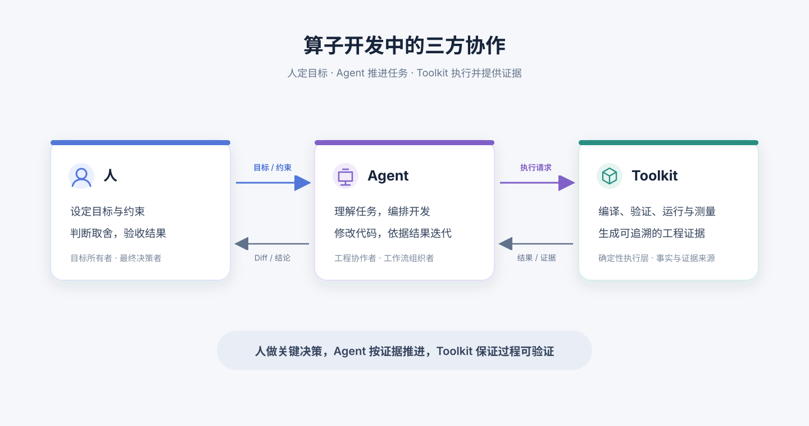

# 人、Agent 与 Toolkit 协作模式：算子开发流程重构建议

> 文档版本：v0.1  
> 更新时间：2026-09-16  
> 适用范围：PyPTO / PTO 算子编码、编译、调试、正确性验证与性能调优  
> 文档性质：基于仓库现有规划提出的产品协作模型，待用户研究与原型验证

---

## 1. 核心判断

过去，开发者是流程的主要操作者：在 IDE 中理解代码、决定下一步、手工调用 Toolkit 完成编译、调试和调优，再自行拼接各处结果。Toolkit 是开发者操作的工具集，开发者负责把步骤串起来。

引入 Codex、Claude Code 等 Coding Agent 后，变化不只是“多了一个写代码入口”。Agent 可以读取工程上下文、制定计划、调用命令、修改代码、观察运行结果并继续迭代。工作流的组织者开始从人转为人和 Agent 协作。因此，三者关系应调整为：

> **人负责目标、边界和验收；Agent 负责理解任务、组织开发迭代并提出可审查的变更；Toolkit 负责提供确定、可组合的执行能力和可信证据。**

三者不是三个并列的产品入口，也不是 Agent 取代 IDE 或 Toolkit。新的工作闭环是：



```text
人的目标与约束
      ↓
Agent 建立上下文、制定计划、调用能力并解释结果
      ↓
Toolkit 执行编译、验证、运行、采集和测量
      ↓
结构化证据回到 Agent 与人
      ↓
Agent 继续迭代；人在关键取舍和最终验收处决策
```

IDE、CLI、Toolkit Studio 仍可作为人和 Agent 接触同一工程的不同界面；底层共享工具接口、运行对象和证据协议。

## 2. 三方角色与责任边界

| 参与方 | 核心责任 | 可以主动完成 | 必须由人决定或批准 |
|---|---|---|---|
| 人（算子开发者） | 定义算子语义、目标硬件、正确性与性能目标、可接受的改动范围；审查并承担最终工程结果 | 补充业务语义、选择精度与性能取舍、调整约束、审查 Diff 和证据、接受或拒绝候选 | 接受语义变化；决定不确定风险是否可接受；确认超出授权范围的高成本或有副作用操作；决定是否将候选纳入团队基线 |
| Agent | 将人的意图转为工程任务；建立上下文、规划步骤、提出和实施局部修改、编排 Toolkit 能力、根据证据迭代并汇报 | 阅读代码与文档、查找相似实现、生成计划和补丁、运行已授权的检查、归纳失败原因、生成候选方案和验证报告 | 不得把推断当作实测；不替人决定算子语义和验收标准；超出任务范围或授权级别时先停下并说明原因 |
| Toolkit | 提供稳定的领域工具和底层执行；约束参数与环境；返回可验证、可复现的结果 | 编译、Verifier、测试、设备运行、Profiler、资源检查、产物关联、日志和证据采集 | 不替 Agent 或人解释未被证据支持的结论；不静默放宽约束、跳过门禁或改变环境 |

### 2.1 人的工作从“逐步操作”转向“设定方向并审查结果”

人不必亲自决定每条命令的先后顺序，但需要把目标说清楚，例如：“在 Ascend 950 上实现该算子，保持 FP32 累加，先达到正确性，再将 P95 延迟降低 10%，不要改公开接口。”人负责提供 Agent 无法可靠推断的数学语义、产品约束和接受标准，并审查改动是否符合预期。

### 2.2 Agent 是工程任务的组织者，不是事实来源

Agent 可以提出假设、代码改动和实验计划，但结论必须回到 Toolkit 产生的编译结果、Verifier 诊断、数值对比或设备 Profiling。Agent 需要将“源码可见”“静态推断”“编译实测”“设备实测”分开表达，并指出证据缺口。

### 2.3 Toolkit 是可调用的领域执行与观测层

Toolkit 不应只为人设计图形界面，也不应退化为 Agent 的黑盒 shell。核心操作要有稳定、结构化、可组合的 CLI/API/MCP 接口，并与 IDE 和 Studio 共用相同的执行逻辑、规则、Run ID 和产物协议。Agent 调用的每个动作都能被人查看、复跑和追溯。

## 3. 新的算子开发作业流

流程由任务目标和当前证据驱动，不要求用户按固定向导逐页操作。Agent 可在获得授权的范围内自动重复“修改—检查—解释”，只有遇到决策边界时才交回给人。

| 环节 | 人 | Agent | Toolkit | 阶段产物 / 通过条件 |
|---|---|---|---|---|
| 1. 提出任务 | 描述目标、输入输出契约、硬件、性能或精度约束 | 将自然语言转成任务摘要；识别缺少的关键条件 | 提供项目、环境、能力和历史基线信息 | 可执行的任务契约；未知条件显式列出 |
| 2. 建立上下文 | 确认数学语义及不可变约束 | 读取相关源码、调用点、测试、文档和历史 Run；汇总实现路径与风险 | 提供索引、环境画像、支持矩阵和关联证据 | 上下文摘要及来源，可回链到工程对象 |
| 3. 规划与授权 | 设定允许修改的目录、运行预算和自动化级别 | 拆分修改和验证计划，预估风险、设备时间与停止条件 | 声明可用操作、参数约束、成本和副作用 | 人确认计划边界；Agent 获得任务级授权 |
| 4. 编码与编译迭代 | 需要时纠正语义或审核重要 Diff | 编写/修改代码，调用编译和静态检查，依据诊断修正 | 执行编译、Pass、Verifier、资源约束检查并产出结果 | 可编译候选；所有修改有 Diff，所有失败有定位 |
| 5. 正确性与调试 | 决定精度标准和允许的数值差异 | 生成或调整测试；根据首个分歧、异常 Tensor 或 Runtime 证据形成假设并定位 | 运行 Reference/Oracle、边界用例、Tensor 对比和低干扰取证 | 正确性门禁通过；否则返回调试迭代并保留证据 |
| 6. 性能调优 | 设定目标指标、预算和不可牺牲的约束 | 分析瓶颈、提出候选、在限定搜索空间内执行实验 | 运行 Profiling 和 Benchmark；每个候选先过正确性与资源门禁 | Baseline/Candidate 对比，收益能归因、结果可复现 |
| 7. 审查与沉淀 | 审查代码、证据、风险，决定是否接受 | 汇总修改、验证、剩余问题及推荐候选 | 固化 Run Manifest、复现命令、基线和实验资产 | 人明确接受的可信候选；可复用、可回归 |

编译、正确性或性能任一门禁失败时，Agent 应回到相应的诊断与修改环节。不能为了让流程“通过”而跳过门禁、放宽断言或把静态估算标成设备实测。

## 4. 以任务对象和证据对象连接三方

建议将 Agent 协作建立在统一的工程对象上，而不是只依靠一段对话历史。

| 对象 | 含义 | 主要内容 |
|---|---|---|
| Task | 人交给 Agent 的工作目标 | 目标、约束、验收条件、范围、预算、授权级别 |
| Candidate | Agent 尝试的一种实现状态 | 源码版本、Diff、参数、设计假设、与 Baseline 的关系 |
| Run | Toolkit 对一个 Candidate 执行的一次确定任务 | 环境指纹、命令、输入、编译/运行配置、状态和产物 |
| Evidence | 支持或否定某项结论的证据 | 源码位置、IR/Pass、Verifier、Tensor/Oracle、Trace、性能指标 |
| Decision | 人对候选或风险作出的工程判断 | 接受、拒绝、继续探索、改变约束或设为新基线 |

关系为：`Task → Candidate → Run → Evidence → Decision`。每个 Candidate 可以有多个 Run；每个 Run 必须关联实际执行的代码、环境和配置。Agent 的结论引用 Evidence，人可以从结论下钻至原始产物，Toolkit 可用相同 Manifest 复跑。

## 5. 自动化权限与人类控制点

权限应由任务级授权和操作风险共同决定，不应由“Agent 模式已开启”推导出无限制执行权。

| 级别 | 操作示例 | 建议默认行为 |
|---|---|---|
| 只读分析 | 阅读工程、查找 API、解释 IR、分析已有 Run | 可自动执行并记录引用来源 |
| 工作区内可逆操作 | 修改任务范围内源码、生成测试、运行快速编译和本地检查 | 在用户授予范围内自动执行；呈现 Diff 和命令 |
| 有成本或环境影响的操作 | 占用设备的长时间基准测试、大规模参数搜索、安装依赖、清理缓存或改环境 | 展示预算、影响和停止条件；依项目策略请求批准 |
| 外部或难以撤销的操作 | 提交、推送、发布、部署、覆盖共享基线 | 必须由人明确发起并最终确认 |

授权记录应附着在 Task 上，Agent 不能从某次批准推断后续任务也获准。所有自动修改、运行和停止原因都应出现在同一任务时间线上。

## 6. 示例：把性能优化任务交给 Agent 协作

开发者提出：“这个 RMSNorm kernel 的结果需要与当前基线一致；请检查 Ascend 950 上的瓶颈，尝试降低延迟，不要改函数接口，最多运行 20 组候选。”

1. Agent 将目标拆成接口不变、正确性匹配、延迟优化和 20 组预算，并读取实现、测试、环境和最近的可信 Baseline。
2. Toolkit 提供当前编译配置、输入形状、设备信息、正确性结果及已有 Profile；Agent 先判断证据是否足够。
3. Agent 提出例如 Chunk 与 pipeline stage 的候选范围，说明假设和预期影响。Toolkit 校验参数范围与资源限制。
4. Agent 逐个生成 Candidate；Toolkit 编译并执行 Verifier。未通过编译或资源门禁的候选立即停止，不进入性能排名。
5. 对通过者，Toolkit 执行正确性测试和受预算约束的 Benchmark，记录原始 Run、离散度与基线对比。
6. Agent 汇总最快且正确的候选、收益证据、被淘汰原因和未覆盖风险。开发者审查 Diff 与数据后，决定接受、继续尝试或维持原基线。

这里的关键变化是：开发者不需要亲自串起每个实验命令，但仍然决定优化目标、约束和最终取舍；Toolkit 的测量结果负责证明 Agent 的判断。

## 7. 对产品形态的影响

### 7.1 从“工具入口”转为“共享工作上下文”

IDE 适合编辑与源码联动，CLI 适合脚本和自动化，Studio 适合观察证据、对比实验。Agent 可从任一入口启动任务，三种入口必须共享项目上下文、Task 状态、Run 产物与诊断协议。用户不应因为从 IDE 切到 Studio 就重新提供一遍问题背景。

### 7.2 Toolkit 的主要产品面向要增加 Agent 工具契约

对每个 Agent 可调用动作，定义清晰的输入、输出、错误、超时、资源预算和副作用。命令返回结构化状态与对象 ID，避免 Agent 解析不稳定的人类日志文本。Toolkit 的 UI 面向人呈现同一动作的执行过程和证据，而不是单独维护一套结果。

### 7.3 交互重点从“聊天回答”转向“可审查的工程进展”

Agent 面板应优先显示：当前目标和边界、已完成与正在运行的动作、源码 Diff、门禁状态、证据引用、下一步计划和需要人的决定。对话用于补充意图和追问；Task、Candidate、Run 与 Evidence 才是可交付的工作状态。

## 8. 建议的落地顺序

### 第一阶段：受控的 Agent 执行闭环

- 为环境检查、编译、Verifier、测试、设备运行和产物查询提供结构化工具接口；
- 统一 Task、Candidate、Run 和 Evidence 的关联标识；
- 支持 Agent 在工作区范围内修改代码、执行快速验证并反馈 Diff；
- 在界面中显示执行轨迹、证据来源和当前授权边界。

### 第二阶段：从失败现象到可信修复

- 让 Agent 基于编译错误、首个数值分歧、hang 和性能回退选择诊断路径；
- 将源码、Pass、Task、Tensor、Trace 与指标连接到同一证据链；
- 支持 Agent 提交最小修复候选并自动重跑相关门禁；
- 统计定位准确率、误改率和修复后的回归情况。

### 第三阶段：受约束的性能实验

- 将调优参数、资源限制、实验预算和停止条件纳入任务契约；
- 由 Toolkit 执行 Candidate 排队、隔离、正确性门禁与性能测量；
- Agent 负责提出搜索策略和解释候选差异；
- 由人决定是否接受候选并更新可信基线。

## 9. 衡量协作是否有效

不以 Agent 发起了多少次工具调用或生成了多少行代码衡量，而以任务是否更快、更可靠地完成衡量：

- 从任务提出到首个可编译候选的时间；
- 从失败发生到定位首个异常证据的时间；
- 首轮正确性通过率，以及 Agent 修改引入的回归率；
- 有证据支持的性能收益比例与实验复现成功率；
- 每个任务中人需要手工串联工具的次数；
- 人审查后接受 Agent 候选的比例，以及拒绝的主要原因。

同时观察护栏指标：越权操作次数必须为零；无证据结论率、绕过正确性门禁的候选数和无法复现的结果应持续下降。

## 10. 与仓库现有规划的关系

这份模型收敛并补充现有规划，不替代其能力清单：

- [PyPTO 3.0 Toolkit 产品功能规划](./PyPTO3.0_Toolkit_产品功能规划.md) 已定义 CLI、IDE Extension、Toolkit Studio、多层能力中心、统一 Run 与自动化控制权；本文补充 Agent 如何跨入口编排这些能力。
- [算子开发 Agent 能力规划与 Coding Agent 原型](./算子开发_Agent_能力规划与_Coding_Agent_原型.md) 已定义 Coding、Guard、调试、正确性、性能等 Agent 能力；本文将它们归并为面向用户的任务协作者，避免要求用户选择内部 Agent 角色。
- [算子作业场景下的 Agent 辅助内容与可视化规划](./算子作业场景_Agent_辅助内容与可视化规划.md) 已规划源码、编译、运行和硬件证据呈现；本文明确这些证据也是 Agent 执行和决策的依据。

现阶段关于权限默认值、自动化程度和人审节点的定义属于产品建议，还需要通过算子开发者访谈和任务原型验证，尤其要确认设备排队成本、工程仓库保护策略以及用户愿意委托 Agent 的操作范围。
