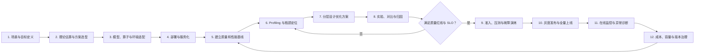
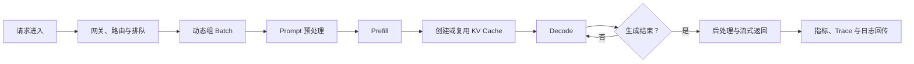

# 大模型推理优化全旅程

> 文档定位：描述大模型从需求输入、方案设计、适配部署、基线评测、性能诊断、优化验证，到灰度上线和持续治理的端到端旅程。  
> 适用对象：推理工程师、模型工程师、性能工程师、平台研发、SRE 与产品设计人员。  
> 核心原则：推理优化不是单点算子优化，而是在质量红线之上，对延迟、吞吐、成本与稳定性进行持续权衡的系统工程。

---

## 一、核心结论

完整的大模型推理优化由两个相互嵌套的循环组成：

1. **工程优化外循环**：定义目标 → 建立基线 → 定位瓶颈 → 设计方案 → 实验验证 → 灰度上线 → 生产治理 → 重新建立基线。
2. **单次请求内循环**：流量进入 → 排队与调度 → Prefill → KV Cache 管理 → Decode → 输出返回 → 指标回传。

优化的最终目标不是让某一个指标达到极值，而是在模型质量满足要求的前提下，寻找并持续维护一条动态的 Pareto 前沿：

> 更低延迟 × 更高吞吐 × 更低成本 × 更高稳定性，同时保持可接受的模型质量。

---

## 二、端到端旅程总览

这条旅程不是一次性瀑布流程。每次模型、权重、硬件、推理引擎、算子、量化方式、流量结构或服务目标发生变化，都可能触发新一轮基线与优化。

---

## 三、阶段一：场景与目标定义

### 3.1 目标

把模糊的“模型太慢、成本太高”转化为可测量、可验收的优化问题。

### 3.2 需要明确的输入

- **业务场景**：实时聊天、代码生成、Agent、RAG、批量推理、离线评测或 RL Rollout。
- **请求结构**：输入长度、输出长度、上下文上限、是否流式输出、是否包含多模态数据。
- **流量模型**：平均与峰值 QPS、并发量、突发程度、租户数量、优先级分布。
- **质量要求**：任务成功率、准确率、生成质量、工具调用成功率、安全性和结构化输出正确率。
- **性能目标**：TTFT、TPOT、ITL、端到端延迟、吞吐和尾延迟。
- **资源约束**：硬件型号、卡数、显存、部署区域、功耗、预算和交付周期。
- **稳定性要求**：可用性、超时率、错误率、OOM 率、恢复时间和降级策略。

### 3.3 关键产物

- 工作负载画像；
- SLO/SLA 与质量红线；
- 资源和成本约束；
- 代表真实业务的评测数据集；
- 验收标准与优化优先级。

### 3.4 阶段门

如果无法说明“在哪类流量、什么硬件、什么质量约束下优化哪个指标”，就不应进入参数调优。

---

## 四、阶段二：理论估算与方案选型

### 4.1 目标

在投入部署和压测之前，快速排除明显不可行的模型、精度、并行和硬件组合。

### 4.2 主要工作

- 估算模型权重、激活和 KV Cache 的显存需求；
- 估算不同输入/输出长度下的计算量与通信量；
- 判断主要负载更偏向 Prefill 还是 Decode；
- 选择推理精度，如 BF16、FP16、FP8、INT8 或 INT4；
- 选择推理引擎和模型格式；
- 设计 TP、PP、DP、EP、CP 等并行策略；
- 判断是否采用 PD 分离、推测解码、Prefix Cache 或量化 KV Cache；
- 根据卡间互联和集群拓扑制定放置方案。

### 4.3 关键产物

- 候选部署方案列表；
- 理论显存、吞吐和通信开销估算；
- 兼容性与风险清单；
- 首轮实验矩阵。

---

## 五、阶段三：模型、算子与环境适配

### 5.1 目标

让模型在目标软硬件环境中正确、稳定、可重复地运行。

### 5.2 主要工作

- 转换权重和模型格式；
- 验证模型架构、Tokenizer、位置编码与推理引擎兼容性；
- 检查算子对 dtype、shape、布局和量化方式的支持；
- 处理自定义算子、融合算子或新模型结构；
- 固化驱动、运行时、框架、推理引擎和算子包版本；
- 建立可复现的容器镜像和启动配置；
- 使用小规模样本完成端到端正确性验证。

### 5.3 阶段门

- 同一输入在固定随机配置下可以复现；
- 输出格式、停止条件和流式返回正确；
- 不存在阻塞上线的兼容性问题；
- 环境、权重、配置和依赖版本可以追溯。

---

## 六、阶段四：部署与服务化

### 6.1 目标

将“模型能够运行”转化为“模型能够作为稳定服务承载目标流量”。

### 6.2 主要工作

- 配置模型 Worker、网关、路由和鉴权；
- 配置张量并行、流水线并行和多机通信；
- 设置最大上下文、最大并发、显存利用率和批处理参数；
- 配置请求队列、优先级、超时、重试和取消；
- 配置健康检查、自动拉起、扩缩容和故障转移；
- 接入请求级 Trace、服务指标、GPU 指标和日志；
- 验证冷启动、模型加载、流式输出与异常返回。

### 6.3 关键产物

- 可部署的服务配置；
- 可观测性埋点；
- 运行手册与故障处理入口；
- 可供基准测试调用的统一服务接口。

---

## 七、阶段五：建立可信基线

### 7.1 目标

建立可复现、可比较、能够代表真实业务的质量与性能基线。

### 7.2 基准测试矩阵

至少覆盖以下维度：

| 维度 | 典型分组 |
|---|---|
| 输入长度 | 短、中、长、超长上下文 |
| 输出长度 | 短回答、普通生成、长生成 |
| 并发模式 | 单请求、固定并发、递增并发、峰值突发 |
| 到达模式 | 恒定速率、Poisson、真实 Trace 回放 |
| 缓存状态 | 冷缓存、热缓存、不同 Prefix 命中率 |
| 服务状态 | 稳态、冷启动、扩缩容、节点故障 |

### 7.3 指标体系

#### 用户体验指标

- TTFT：首 Token 延迟；
- TPOT：每个输出 Token 的平均延迟；
- ITL：相邻 Token 间延迟；
- E2E Latency：端到端延迟；
- P50、P95、P99 尾延迟；
- SLA 达标率与请求成功率。

#### 系统效率指标

- requests/s、tokens/s；
- Prefill 与 Decode 吞吐；
- 排队时间、调度时间和 Batch 利用率；
- GPU 计算利用率、显存占用和显存带宽；
- KV Cache 容量、命中率、淘汰率和碎片率；
- 卡间通信时间、同步等待和空泡比例。

#### 质量与成本指标

- 任务准确率、成功率和安全指标；
- Logit、Logprob 或层级张量偏差；
- 每请求成本、每百万 Token 成本；
- 每个成功任务成本；
- 单卡有效吞吐和集群资源利用率。

### 7.4 基线纪律

- 固定模型、权重、引擎、精度、硬件和依赖版本；
- 保留原始测试结果和运行配置；
- 预热完成后再采集稳态数据；
- 将平均值和 P95/P99 同时纳入判断；
- 不用合成流量完全替代真实流量回放。

---

## 八、阶段六：单次请求链路拆解与瓶颈定位

### 8.1 常见瓶颈模式

| 现象 | 可能瓶颈 | 需要继续验证的证据 |
|---|---|---|
| 长输入时 TTFT 明显升高 | Prefill 计算或长上下文注意力 | Prefill 耗时、Kernel、输入长度分桶 |
| TPOT 高但 GPU 算力未满 | 显存带宽、KV Cache 或 Batch 不足 | HBM 带宽、Cache 占用、Batch 时间序列 |
| 平均延迟正常但 P99 很高 | 排队、长短请求互相阻塞或抢占 | 请求级 Trace、队列时间、调度事件 |
| 高并发时吞吐不再增长 | 调度、显存容量或通信达到上限 | Batch 利用率、显存、通信和请求拒绝率 |
| 多卡扩展效率下降 | 集合通信或负载不均 | Rank 对齐、通信耗时、慢卡和空泡 |
| GPU 利用率低且端到端延迟高 | CPU、网络、数据处理或外部工具 | CPU Trace、网络耗时、工具调用链 |
| 量化后速度未提升 | 硬件不原生支持或转换开销过高 | Kernel 类型、量化/反量化耗时、Batch 变化 |

### 8.2 诊断下钻路径

应支持从业务指标逐层下钻：

> 服务 SLO → 请求阶段 → 调度与 Batch → Prefill/Decode → 模型模块 → 通信/算子 → Kernel → 硬件资源

每个诊断结论都应包含：**现象、证据、推断、置信度、建议实验**，避免仅凭单一指标直接归因。

---

## 九、阶段七：分层设计优化方案

### 9.1 请求与产品层

- 缩短系统提示词和无效上下文；
- 对历史对话进行摘要、裁剪或选择性检索；
- 使用 Prompt Cache、Prefix Cache 或语义缓存；
- 根据任务复杂度进行模型路由；
- 优化最大输出长度和停止条件；
- 将非实时请求批处理或异步化；
- 为高峰期配置限流、降级和优先级策略。

### 9.2 解码算法层

- 调整 Temperature、Top-p、Top-k 等采样配置；
- 使用推测解码或多 Token 预测；
- 使用结构化输出和语法约束缩小搜索空间；
- 按场景选择 Greedy、Sampling 或 Beam Search；
- 评估推测解码接受率与附加计算开销。

### 9.3 模型压缩层

- 权重、激活和 KV Cache 量化；
- BF16/FP16 向 FP8、INT8、INT4 转换；
- 蒸馏到更小模型；
- 剪枝、稀疏化或专家模型优化；
- 针对目标硬件选择原生支持的精度组合。

### 9.4 算子、Kernel 与编译层

- FlashAttention、Paged Attention；
- 算子融合和高效 GEMM Kernel；
- CUDA Graph 或同类执行图优化；
- 静态图编译、Shape 特化和 Autotuning；
- 减少 CPU–设备同步、数据复制和 Kernel Launch；
- 优化通信与计算重叠。

### 9.5 推理引擎层

- Continuous Batching；
- Paged KV Cache；
- Chunked Prefill；
- Prefix Cache；
- 请求抢占、优先级和长短请求隔离；
- KV Cache 分块、复用、卸载和淘汰；
- Prefill–Decode 分离部署；
- 多 LoRA 动态加载和调度。

### 9.6 分布式与硬件层

- 调整 TP、PP、DP、EP、CP 的组合；
- 根据 NVLink、PCIe 或高速网络拓扑放置模型；
- 减少跨节点通信和不必要的数据搬运；
- 优化 CPU、GPU、网络和存储的数据路径；
- 根据负载选择更合适的 GPU/NPU 型号和实例规格；
- 评估扩卡后的加速比与单位成本，而非只看总吞吐。

---

## 十、阶段八：实验、对比与归因

### 10.1 最小实验闭环

### 10.2 实验原则

- 一轮实验尽量只验证一个主要假设；
- 所有实验保留完整配置、环境、数据集和原始结果；
- 同时比较优化前后质量和性能；
- 对性能波动进行重复测试和统计判断；
- 不将理论收益直接视为真实服务收益；
- 优化后重新 Profiling，因为瓶颈可能已经转移。

### 10.3 组合优化的相互作用

- 量化降低显存占用后，最优 Batch Size 可能改变；
- Prefix Cache 提高命中率后，瓶颈可能从 Prefill 转移到 Decode；
- 吞吐提升后，排队和调度可能成为新的尾延迟来源；
- 推测解码在接受率低时可能增加延迟；
- 增加并行度可能降低单卡利用率并提高通信成本；
- 更激进的 KV Cache 策略可能引入精度、抖动或淘汰风险。

---

## 十一、阶段九：四道上线准入门

| 准入门 | 核心问题 | 典型检查项 |
|---|---|---|
| 质量门 | 输出是否仍然可信可用 | 任务效果、精度偏差、安全性、结构化输出、工具调用 |
| 性能门 | 用户体验和系统效率是否改善 | TTFT、TPOT、吞吐、P95/P99、SLA 达标率 |
| 稳定性门 | 长时间和异常情况下是否可靠 | OOM、泄漏、死锁、超时、重试、节点故障、缓存异常 |
| 成本门 | 总体经济性是否改善 | 每 Token、每请求、每成功任务成本和资源利用率 |

四道门需要同时满足。不能通过牺牲质量、安全或稳定性，换取孤立的吞吐提升。

---

## 十二、阶段十：灰度发布与全量上线

### 12.1 推荐发布路径

1. 使用影子流量验证候选版本；
2. 以少量真实流量进行 Canary；
3. 按 1% → 5% → 20% → 50% → 100% 逐步放量；
4. 新旧版本保持同口径 A/B 对照；
5. 为质量、错误率和尾延迟设置自动回滚阈值；
6. 完成峰值压测、容量测试和故障注入；
7. 确认降级、回滚和数据追溯路径有效后再全量上线。

### 12.2 重点观察

- 真实请求长度分布是否与离线基准一致；
- P95/P99 和 SLA 达标率是否恶化；
- 缓存命中、排队和扩缩容是否符合预期；
- 质量回归是否集中在特定场景或租户；
- 成本下降是否来自真实效率提升，而非流量或质量变化。

---

## 十三、阶段十一：在线监控与异常诊断

### 13.1 在线监控维度

- 请求量、并发、输入/输出 Token 分布；
- TTFT、TPOT、ITL、端到端延迟和 SLA 达标率；
- 排队时间、Batch Size、抢占和调度失败；
- GPU/NPU 利用率、显存、功耗和温度；
- KV Cache 命中、占用、淘汰和碎片；
- 通信、网络、节点和 Rank 健康；
- OOM、超时、错误码、取消和重试；
- 模型质量、用户反馈和任务成功率；
- 分模型、租户、场景和版本的单位成本。

### 13.2 从告警到闭环

---

## 十四、阶段十二：持续治理

### 14.1 容量治理

- 根据流量和 Token 分布预测资源需求；
- 建立不同模型、硬件和配置的容量曲线；
- 为峰值、故障和扩容延迟预留容量；
- 识别低利用率实例和资源碎片；
- 按场景制定扩缩容和流量迁移策略。

### 14.2 版本治理

- 记录模型、权重、Tokenizer、框架、引擎、算子、驱动和硬件版本；
- 对每次变更自动触发质量与性能回归；
- 支持跨版本、跨硬件、跨配置的自动 Diff；
- 对回退、兼容性变化和已知问题建立可查询记录。

### 14.3 配置知识库

将每次实验沉淀为：

> 模型与版本 + 硬件拓扑 + 工作负载 + SLO + 配置 → 质量、性能、成本结果与适用边界

新模型或新流量上线时，先从历史经验中推荐初始配置，再进行小范围搜索，减少重复试错。

---

## 十五、参与角色与协作关系

| 角色 | 主要职责 |
|---|---|
| 业务/产品 | 定义场景、体验目标、质量红线和成本约束 |
| 模型工程师 | 模型结构、精度、量化、蒸馏和解码策略 |
| 推理工程师 | 引擎、调度、KV Cache、并行和服务参数 |
| 算子/性能工程师 | Kernel、编译、通信和硬件性能分析 |
| 平台工程师 | 实验编排、部署、资源调度和工具链集成 |
| 评测工程师 | 数据集、质量评测、回归和准入标准 |
| SRE/运维 | 可观测性、容量、发布、故障和稳定性治理 |

共同协作对象应是统一的“任务/实验”，而不是分散的日志、图表和配置文件。

---

## 十六、完整交付物清单

一个成熟的推理优化项目最终应沉淀以下资产：

- 工作负载画像和 SLO；
- 质量评测集与性能基准集；
- 环境、模型和服务配置清单；
- 理论容量和显存估算；
- 请求级 Trace 与系统级 Profile；
- 瓶颈分析报告；
- 优化实验矩阵和自动对比报告；
- 质量、性能、稳定性和成本准入报告；
- 灰度、回滚和故障演练方案；
- 在线监控和告警规则；
- 容量模型与成本模型；
- 配置知识库和版本变更记录；
- 故障复盘与回归用例。

---

## 十七、成熟度演进

### L1：可运行

- 模型能够部署并正确返回结果；
- 有基础服务监控；
- 优化主要依赖个人经验。

### L2：可测量

- 建立统一指标和基准测试；
- 能区分 Prefill、Decode 和排队耗时；
- 实验结果可以复现。

### L3：可诊断

- 能从服务指标下钻到调度、通信、算子和硬件；
- 支持跨实验自动 Diff；
- 诊断结论能够关联证据。

### L4：可回归

- 质量、性能和稳定性进入统一准入流程；
- 版本变更自动触发回归；
- 支持灰度、回滚和故障演练。

### L5：可自适应

- 能识别流量和瓶颈变化；
- 自动推荐或搜索候选配置；
- 经离线验证和灰度后安全调整线上策略；
- 持续积累可复用的配置知识。

---

## 十八、实施检查清单

### 开始优化前

- [ ] 已明确业务场景和真实工作负载；
- [ ] 已定义质量红线、SLO 和成本目标；
- [ ] 已固定环境、模型、引擎和硬件版本；
- [ ] 已准备质量评测集与性能基准集；
- [ ] 已建立请求、服务和硬件层可观测性。

### 进行实验时

- [ ] 每个实验都有明确且可证伪的假设；
- [ ] 已冻结无关变量；
- [ ] 已同时记录质量、性能、资源和成本；
- [ ] 已保留原始数据、完整配置与运行日志；
- [ ] 已进行重复测试并检查波动；
- [ ] 已确认收益在真实流量结构下仍成立。

### 上线前

- [ ] 已通过质量、性能、稳定性和成本四道门；
- [ ] 已完成峰值容量测试；
- [ ] 已完成关键故障演练；
- [ ] 已配置灰度和自动回滚阈值；
- [ ] 已确认监控、告警、降级和回滚路径。

### 上线后

- [ ] 已持续跟踪 P95/P99 和 SLA 达标率；
- [ ] 已监控流量长度与缓存模式变化；
- [ ] 已按版本、模型、租户和场景拆分质量与成本；
- [ ] 已将异常和优化结论沉淀为回归用例；
- [ ] 已更新容量模型与配置知识库。

---

## 十九、总结

大模型推理优化的完整旅程，本质上是把“运行模型”升级为一套可测量、可诊断、可比较、可回归、可持续演进的生产工程体系。

真正成熟的交付物不是某个更快的 Kernel、某组最优参数或某张性能图，而是由以下能力构成的闭环：

> 统一目标 → 统一基线 → 全链路观测 → 证据化诊断 → 分层优化 → 质量与性能验证 → 安全发布 → 在线反馈 → 知识沉淀

当这个闭环建立后，团队才能在模型、硬件、引擎和业务流量不断变化的情况下，持续获得稳定、可解释且可复现的优化收益。
