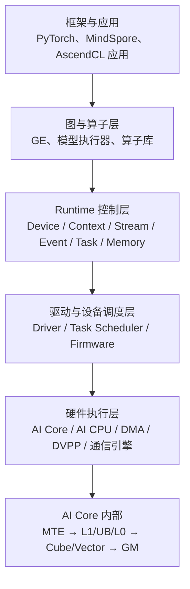
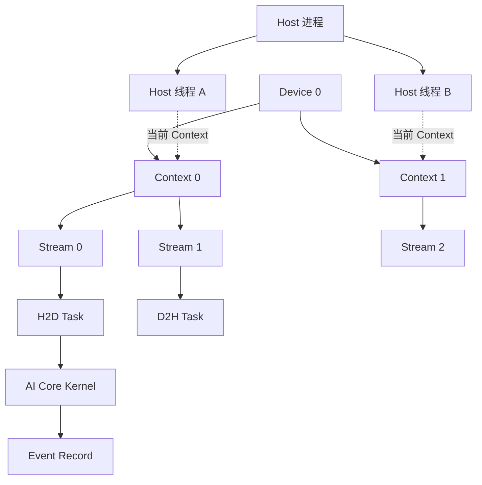
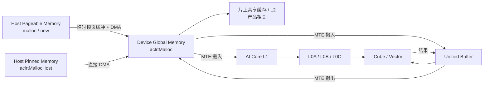

# 华为昇腾 CANN Runtime 与硬件关系学习指南

> 适用读者：希望系统理解 CANN Runtime、AscendCL、昇腾硬件、内存层级、数据搬运和任务调度关系的开发者。
>
> 文档范围：以 CANN 8.x 公开资料中的稳定抽象为主，参考部分 CANN 9.x Runtime 文档。不同芯片、产品形态和 CANN 版本可能存在差异，具体接口与能力应以目标产品配套文档为准。

## 1. 阅读目标

阅读本文后，应当能够回答以下问题：

1. CANN Runtime 在整个昇腾软件栈中处于什么位置？
2. Device、Context、Stream、Event、Task、Kernel 分别代表什么？
3. 这些 Runtime 对象与 AI Core、AI CPU、DMA、DVPP 等硬件是什么关系？
4. Host 内存、Device Global Memory、L2、L1、UB、L0 分别由谁管理？
5. 一次 H2D、Kernel 执行和 D2H 在软硬件中经过了哪些环节？
6. Stream、Event、Task Scheduler 和 Kernel 内部流水分别控制哪一层调度？
7. 分析性能问题时，如何判断瓶颈位于下发、调度、搬运、带宽还是计算？

---

## 2. 一张图理解整套系统

可以把昇腾程序的运行过程划分为四个主要层次：



CANN Runtime 的核心职责不是定义“矩阵乘法怎么算”，而是：

> 决定在哪个设备上、使用哪些资源和内存、按照什么顺序提交哪些任务，以及在什么时候确认任务已经完成。

算子的数学实现、Tiling 和 AI Core 内部流水主要属于算子、编译器与 Kernel 层；设备选择、任务提交、队列顺序、跨队列依赖、设备内存和完成通知主要属于 Runtime 层。

### 2.1 广义 Runtime 与狭义 Runtime

“Runtime”在昇腾资料中可能有两种语境：

- **广义 Runtime**：从模型或算子执行，到设备资源管理、任务下发、驱动交互和完成通知的整条运行链路。
- **狭义 Runtime API**：主要指 `aclrt*` 接口所提供的 Device、Context、Stream、Event、Memory、Kernel Launch 等能力。

AscendCL 是面向应用的统一 C API。Runtime 管理只是 AscendCL 的一部分，模型执行、算子调用、媒体处理等高层接口内部同样会依赖 Runtime。

---

## 3. Runtime 对象与硬件的对应关系

最重要的原则是：

> 大多数 Runtime 对象是软件抽象，不与某一个硬件单元一一对应。

| Runtime 概念 | 软件含义 | 与硬件的关系 |
| --- | --- | --- |
| Device | Runtime 可使用的逻辑计算设备 | 通常对应一个可寻址的昇腾设备，但不能简单等同于整张板卡、单颗芯片或一个 AI Core |
| Context | 设备资源、任务和对象的归属及隔离容器 | 是面向某个 Device 的软件执行环境，不是物理计算核 |
| Stream | 按顺序提交任务的逻辑队列 | 不等于 AI Core、DMA 通道或 Host 线程；设备根据任务类型选择执行资源 |
| Task | Stream 中真正被设备处理的命令 | 可能是 Kernel、Memcpy、Event、Notify、通信或媒体任务 |
| Kernel | 设备侧计算程序 | 可以运行在 AI Core 或 AI CPU 上，具体取决于 Kernel 类型 |
| Event | 插入任务序列的完成标记和依赖节点 | 用于 Stream 间依赖或 Host 等待，不是一块计算硬件 |
| Device Memory | Device 全局地址空间中的内存 | 存放 Tensor、权重、Workspace、参数和中间结果 |
| `blockDim` | Kernel 的逻辑并行 Block 数 | 与使用多少计算核相关，但不是把 Stream 永久绑定到某几个核 |

### 3.1 对象层级



可以用一句话记住它们：

> Device 决定“去哪算”，Context 决定“以哪套资源身份算”，Stream 决定“任务的先后关系”，Task 决定“具体做什么”。

### 3.2 Device

Device 是 Runtime 看到的逻辑计算设备。它代表一组可管理的设备侧计算和内存资源。

需要避免几个过度简化：

- Device ID 不等于 AI Core ID。
- Device 不一定等于物理服务器中的整张板卡。
- 多芯片板卡、虚拟化或逻辑设备场景下，软件 Device 与物理实体的映射可能更加复杂。
- 多个 Device 的普通设备内存默认相互独立，跨 Device 访问需要 P2P 或通信机制。

### 3.3 Context

Context 是设备资源和 Runtime 对象的归属容器，主要作用包括：

- 关联目标 Device；
- 归属和管理 Stream、Event、设备内存等资源；
- 隔离不同执行环境；
- 作为线程进行设备操作时的当前执行上下文。

一个 Host 线程在某一时刻有一个当前 Context。进程中的 Context 可以被不同线程切换使用，但多线程设计时应明确 Context 的归属和切换规则，避免任务被提交到错误设备。

默认 Context 适合单设备、简单流程；显式 Context 更适合多设备、多线程或需要明确资源边界的程序。

### 3.4 Stream

Stream 是一个有序任务队列。Runtime 保证同一 Stream 中任务按照提交顺序建立先后关系。

```text
Stream 0: H2D(A) → Kernel(A) → D2H(A)
Stream 1: H2D(B) → Kernel(B) → D2H(B)
```

Stream 提供的是并行机会，而不是并行承诺：

- 同一 Stream 中任务保序。
- 不同 Stream 中无依赖的任务有机会并行或重叠。
- 是否真正并行取决于硬件资源、任务类型、资源占用、数据依赖和设备能力。
- Stream 不会永久绑定到某个 AI Core 或某个 DMA 引擎。
- 创建更多 Stream 不一定提高吞吐量，过多 Stream 还可能增加资源与调度开销。

### 3.5 Task 与 Kernel

Task 是 Device 上真正的任务执行体或控制命令。一个 Stream 中可以包含多种 Task：

- Host-to-Device、Device-to-Host、Device-to-Device Memcpy；
- AI Core Kernel；
- AI CPU Kernel；
- Event Record、Event Wait；
- Notify 或其他同步控制任务；
- HCCL 通信任务；
- DVPP、视频或图像处理任务。

Kernel 是 Task 的一种。一次模型执行通常会展开为大量 Task，而不是只对应一个 Kernel。

### 3.6 Event

Event 是任务流中的完成标记和依赖节点，典型关系如下：

```text
Stream A: Kernel A → Record Event E
Stream B: Wait Event E → Kernel B
```

Event 有两种常见使用方式：

- Host 调用同步接口，等待 Event 完成；
- 某个 Stream 等待 Event，从而建立跨 Stream 的设备侧依赖。

第二种方式不等于阻塞 Host 线程。Host 可以继续下发其他工作，只有等待 Event 的 Stream 后续任务不能越过依赖点执行。

---

## 4. 昇腾内存体系：三个不同的管理世界

理解内存时，必须把以下三个层级分开：

1. Host 内存；
2. Device Global Memory；
3. AI Core Local Memory。



### 4.1 Host Pageable Memory

Pageable Memory 由 `malloc`、`new`、`mmap` 等普通接口申请，由操作系统管理，必要时可以换出到交换空间。

在典型异构计算场景中，Pageable Memory 不能直接稳定地作为异步 DMA 的长期数据源。数据通常需要先复制到 Runtime 管理的锁页缓冲区，再通过 DMA 搬运到 Device：

```text
Host Pageable Memory
    ↓ CPU 内存复制
临时 Pinned Buffer
    ↓ PCIe / DMA
Device Global Memory
```

它的优势是使用简单，代价是可能多一次 Host 内存复制。

### 4.2 Host Pinned/Page-Locked Memory

Pinned Memory 通常通过 `aclrtMallocHost` 等接口申请。其虚拟页和物理页映射在生命周期内保持固定，不会被操作系统换出，因此可以被 DMA 稳定访问：

```text
Host Pinned Memory
    ↓ PCIe / DMA
Device Global Memory
```

适合：

- 异步 H2D/D2H；
- 高频数据传输；
- 多 Stream 流水；
- 需要传输与计算重叠的场景。

Pinned Memory 并非越多越好。大量锁页会降低操作系统可换页内存，应采用容量受控、可复用的缓冲池。

### 4.3 Device Global Memory

通过 `aclrtMalloc` 等接口申请的设备线性内存属于 Device Global Memory，简称 GM。典型内容包括：

- 模型权重；
- 输入输出 Tensor；
- Kernel 参数；
- 算子 Workspace；
- 模型中间结果；
- 通信 Buffer；
- 部分媒体处理数据。

GM 是编程模型与设备寻址概念，不应在所有产品上无条件等同于 HBM。训练卡和高端推理卡上通常由 HBM 承载主要设备全局内存；SoC、边缘产品可能使用不同的物理内存实现。

频繁调用 `aclrtMalloc/aclrtFree` 会增加同步和管理开销。高性能应用通常会：

- 在初始化阶段预分配；
- 建立 Device Memory Pool；
- 按生命周期复用 Buffer；
- 由模型或框架内存规划器复用中间 Tensor；
- 避免在主执行循环中频繁申请和释放。

### 4.4 DVPP 内存

图像、视频等媒体处理通常要求使用 `acldvppMalloc` 或产品对应的媒体内存接口。

更准确的理解是：

> DVPP 内存是一种满足媒体硬件访问、映射、对齐和属性要求的分配域，而不应简单推导为物理上一定存在一块完全独立的“DVPP 显存”。

DVPP 内存是否能被 AI Core 直接使用、是否需要复制、支持哪些共享方式，取决于产品与 CANN 版本。

### 4.5 P2P 与跨 Device 内存

普通 Device Memory 属于对应 Device。两个 Device 之间进行直接访问或复制前，通常需要：

1. 查询 Peer Access 能力；
2. 启用 Peer Access；
3. 使用 Device-to-Device 复制或通信接口；
4. 正确处理两个 Device 的 Context 和同步关系。

实际物理路径可能经过 PCIe、HCCS 或其他互联。API 层的 P2P 语义不代表所有硬件拓扑下都有相同带宽和时延。

### 4.6 AI Core Local Memory

AI Core 内部包含多级 Local Memory，常见单元包括：

| 内存单元 | 主要用途 |
| --- | --- |
| L1 Buffer | 较大的片上数据中转区，减少重复访问 GM |
| Unified Buffer | Vector 计算和通用片上数据处理的重要缓冲区 |
| L0A / L0B | Cube 矩阵计算输入 |
| L0C | Cube 矩阵计算结果 |
| Scalar/Data Cache | 标量控制、地址计算和数据访问，具体能力与产品相关 |
| Instruction Cache | 缓存设备指令，具体结构与产品相关 |

AI Core 的典型数据处理过程是：

```text
Device GM
   ↓ MTE 搬入
L1 / UB / L0
   ↓
Cube / Vector / Scalar 计算
   ↓ MTE 或 Fixpipe 搬出
Device GM
```

这些 Local Memory 通常不由应用侧 `aclrtMalloc` 直接分配，而是由以下部分共同管理：

- Ascend C Kernel 代码；
- 编译器；
- Tiling 策略；
- Pipeline 和 Queue 抽象；
- 芯片对应的片上资源约束。

### 4.7 两类“内存优化”必须分开

| Runtime/应用侧内存优化 | Kernel/算子侧内存优化 |
| --- | --- |
| 使用 Pinned Host Memory | 设计合理 Tiling |
| 减少 H2D/D2H 次数 | 保证 GM 连续、合并访问 |
| 预分配和 Buffer Pool | 使用 UB/L1 复用数据 |
| 多 Stream 流水 | 使用 Double Buffer |
| 减少无意义同步 | 重叠 MTE 搬运与计算 |
| 复用 Workspace | 控制片上内存占用和流水深度 |

---

## 5. 两种 DMA/MTE 搬运不能混淆

昇腾系统中至少存在两个不同层级的数据搬运概念。

### 5.1 Host 与 Device 之间的系统级 DMA

典型路径：

```text
Host DRAM → PCIe/DMA → Device GM
Device GM → PCIe/DMA → Host DRAM
```

该层由 Runtime、Driver 和系统级 DMA/互联共同完成，应用通过 `aclrtMemcpy*` 等接口控制。

### 5.2 AI Core 内部的 MTE 搬运

典型路径：

```text
Device GM → MTE → UB/L1/L0
UB/L1/L0 → MTE/Fixpipe → Device GM
```

该层发生在一次 Kernel 的内部，由 Kernel 指令、Ascend C Pipeline 和编译结果控制。

因此：

> `aclrtMemcpyAsync` 解决的是系统级地址空间之间的数据移动；Ascend C 的 `DataCopy`、MTE 流水解决的是 Kernel 内部 GM 与 Local Memory 之间的数据供应问题。

---

## 6. 一次典型推理的数据流

以下以 EP 模式下 Host 运行应用为例。

### 6.1 Host 准备输入

```text
文件 / 网络 / 业务数据
        ↓
Host Input Buffer
```

为了进行高效异步传输，Host Input Buffer 通常使用 Pinned Memory。

### 6.2 下发 H2D Task

```cpp
aclrtMemcpyAsync(deviceInput,
                 deviceInputCapacity,
                 hostInput,
                 inputBytes,
                 ACL_MEMCPY_HOST_TO_DEVICE,
                 stream);
```

异步接口返回成功一般只表示任务成功下发，不表示数据已经到达 Device。Host Buffer 在传输任务真正完成前必须保持有效，不能提前释放或修改。

### 6.3 下发模型或 Kernel Task

直接 Launch Kernel 时，Runtime 需要获得或组装以下信息：

- Kernel 函数或函数句柄；
- Kernel 参数及其地址；
- 参数大小；
- `blockDim`；
- 目标 Stream；
- 可选的任务配置。

模型执行时，一个高层模型调用可能展开为：

```text
Memcpy / TransData
→ AI Core Kernel
→ AI Core Kernel
→ AI CPU Kernel
→ Event / Notify
→ 通信任务
→ AI Core Kernel
```

### 6.4 Runtime 与 Driver 提交任务

可以把控制路径抽象为：

```text
Host Application / Framework
        ↓
AscendCL / GE
        ↓
Runtime：构造任务、维护 Stream 和依赖
        ↓
Driver：设备资源与命令通道
        ↓
Device Task Scheduler / Firmware
        ↓
AI Core / AI CPU / DMA / DVPP
```

控制信息和 Tensor 数据通常走不同的逻辑路径：

- 控制面传递任务描述、地址、参数、依赖和调度信息；
- 数据面传递输入 Tensor、输出 Tensor、权重和中间数据。

### 6.5 AI Core 执行 Kernel

以一个典型 Ascend C Kernel 为例：

```text
GM 输入
  ↓ MTE2 / DataCopy
UB 或 L1
  ↓ 可选的数据变换和继续搬运
L0A / L0B
  ↓ Cube / Vector
L0C 或 UB
  ↓ Fixpipe / MTE3 / DataCopy
GM 输出
```

具体通路取决于算子类型、芯片架构以及 Cube/Vector 是耦合还是分离部署。

### 6.6 下发 D2H 与完成通知

如果 D2H 与 Kernel 位于同一个 Stream：

```text
Kernel → D2H → Record Event
```

Stream 的保序语义保证 D2H 不会在前面的 Kernel 完成之前开始处理其输出依赖。Host 可以通过以下方式确认完成：

- 等待 Event；
- 同步某个 Stream；
- 同步当前 Device。

等待范围从小到大通常是：Event、Stream、Device。为了保持流水，应优先使用满足正确性的最小同步范围。

---

## 7. 调度体系：三种并行层级

### 7.1 Host 下发并行

多个 Host 线程可以通过不同 Context 或 Stream 提交任务。此层常见瓶颈包括：

- Host CPU 性能；
- Runtime API 下发开销；
- Context 切换；
- 小 Task 数量过多；
- 多线程锁竞争；
- 框架或模型执行器的串行控制逻辑。

### 7.2 Device Task 级并行

不同 Stream 中无依赖的 Task 有机会并行。例如：

```text
时间 ───────────────────────────────────────────────→

Stream 0: H2D(batch N+1) ───────────────
Stream 1:       Kernel(batch N) ────────────────────
Stream 2:                 D2H(batch N-1) ───────────
```

这是系统级流水并行，目标是重叠：

- Host↔Device 搬运；
- AI Core 计算；
- Device↔Host 搬运；
- 不同批次或不同模型任务。

实际能否重叠取决于硬件是否存在可并行工作的执行资源以及任务是否争用同一带宽或计算单元。

### 7.3 Kernel 内部并行

Kernel 内部并行由以下因素决定：

- `blockDim` 和数据分片；
- 每个 Block 处理的数据范围；
- Cube、Vector、Scalar 的协同；
- MTE 搬运和计算流水重叠；
- Double Buffer；
- 指令级并行；
- GM、L1、UB、L0 的访问模式。

这一层主要由 Ascend C Kernel 和编译器控制，而不是由 Stream 数量直接控制。

### 7.4 Task Scheduler 的正确理解

公开资料能够确认的是：

- Runtime 向 Driver 提交任务；
- Driver 负责设备资源、命令和状态交互；
- Task Scheduler 负责 Device 任务序列的管理、调度与执行；
- 设备完成后通过相应报告或状态机制反馈 Runtime。

以下细节通常与具体芯片、固件和版本相关，不宜从 Runtime API 反向臆测：

- 每个周期如何选择物理 AI Core；
- 每种任务是否对应固定硬件队列；
- Stream 与硬件队列的精确映射；
- 多任务抢占和资源仲裁的所有内部规则；
- Task Scheduler 在不同芯片代际中的微架构差异。

---

## 8. 同步、异步与依赖关系

### 8.1 异步接口的准确语义

异步接口成功返回通常代表：

```text
任务已成功进入 Runtime/设备提交流程
```

不代表：

```text
设备已经执行完成
```

因此，在任务完成前：

- 输入 Buffer 不能提前释放；
- 输出 Buffer 不能被 Host 提前读取；
- Kernel 参数和相关描述必须满足接口规定的生命周期；
- Context、Stream 不能提前销毁。

### 8.2 Stream 内依赖

同一 Stream 中天然保序：

```text
H2D → Kernel A → Kernel B → D2H
```

如果所有任务都属于同一个 Stream，通常不需要在它们之间插入 Host 同步。

### 8.3 Stream 间依赖

跨 Stream 依赖应使用 Event 等设备侧机制：

```text
Stream A: Producer Kernel → Record E
Stream B: Wait E → Consumer Kernel
```

这样可以让 Host 保持异步下发，同时只约束真正存在依赖的 Task。

### 8.4 避免全局同步

不必要的 `SynchronizeDevice` 会等待当前 Device 上更大范围的工作，可能破坏多 Stream 流水。优化时应遵循：

1. 能用 Stream 内保序，就不添加同步；
2. 能用 Event 表达依赖，就不阻塞 Host；
3. 能同步单个 Stream，就不做 Device 全局同步；
4. 只在 Host 必须消费结果时进行 Host 等待。

---

## 9. EP 与 RC 模式对数据流的影响

### 9.1 EP 模式

典型服务器加速卡形态：

```text
Host CPU + Host DRAM
        │
        │ PCIe
        ▼
Ascend Device + Device Memory
```

应用通常运行在 Host，H2D/D2H 是实际的跨 PCIe 或相应互联搬运。

### 9.2 RC/SoC 模式

应用可能直接运行在昇腾设备的 CPU 上：

```text
Device CPU + Device Memory + AI Core
```

接口仍可能保留 Host/Device 概念以维持软件兼容性，但物理上不一定发生 PCIe 传输。部分 RC 板端场景下，涉及 Host 的复制类型会在内部按 Device 内复制处理。

因此，分析数据路径之前必须确认：

- 应用运行在服务器 Host，还是 Device CPU；
- 产品处于 EP 还是 RC 模式；
- Host 与 Device 地址是否属于不同物理内存；
- 当前复制最终是 PCIe DMA、Device 内 DMA、内存映射还是其他路径。

---

## 10. 常见误区

### 误区 1：Stream 等于一个 AI Core

错误。Stream 是逻辑任务队列，一个 Stream 中可以包含 AI Core、AI CPU、Memcpy、Event 等不同任务。

### 误区 2：Context 等于一个 Device

错误。Context 关联 Device，但一个 Device 可以存在多个 Context。

### 误区 3：异步复制返回成功表示数据已经复制完成

错误。返回成功通常只表示任务下发成功，必须使用 Event 或同步接口确认完成。

### 误区 4：Device GM 一定是 HBM

不严谨。GM 是设备全局内存的编程概念，物理介质取决于产品形态。

### 误区 5：MTE 就是 PCIe DMA

错误。PCIe/DMA 主要处理 Host 与 Device 地址空间之间的数据移动；MTE 主要处理 AI Core 内部 GM 与 Local Memory 之间的数据搬运。

### 误区 6：多 Stream 一定提高性能

错误。多 Stream 只创造并行机会。如果 AI Core、GM 带宽或互联已经饱和，增加 Stream 可能无收益甚至变慢。

### 误区 7：一个模型执行调用等于一个 Kernel

通常错误。一个模型往往展开为大量计算、复制、同步和通信 Task。

### 误区 8：Event 只是 Host 信号量

不准确。Event 首先是 Runtime 任务流中的完成标记和依赖机制，也可以被 Host 等待。

### 误区 9：Runtime 管理 UB、L0 的动态申请

错误。Runtime 主要管理 Device GM 等系统级资源；UB、L1、L0 等片上 Local Memory 主要由 Kernel、编译器和 Tiling/Pipeline 管理。

---

## 11. 性能分析框架

面对一个性能问题，可以从以下四层逐步定位。

### 11.1 Host 与任务下发层

检查：

- Host API 调用之间是否存在明显空洞；
- 是否有大量很小的 Kernel；
- 是否频繁创建销毁 Context、Stream、Event；
- 是否频繁申请释放 Device Memory；
- 是否存在不必要的同步；
- Host 线程是否成为瓶颈。

典型优化：

- 合并小任务；
- 使用模型执行或任务捕获降低重复下发开销；
- 复用 Runtime 对象；
- 建立 Host/Device 内存池；
- 减少 Context 切换。

### 11.2 Host↔Device 数据传输层

检查：

- 是否使用 Pinned Memory；
- H2D/D2H 是否过于频繁；
- 传输粒度是否过小；
- 传输与计算是否重叠；
- 是否反复搬运本可以常驻 Device 的权重或中间数据；
- PCIe 或互联带宽是否接近上限。

典型优化：

- 固定并复用 Pinned Buffer；
- 批量传输；
- 权重和常量常驻 Device；
- 双缓冲、多 Stream 流水；
- 减少 Host 参与的中间结果处理。

### 11.3 Device Task 调度层

检查：

- Stream 之间是否有过度依赖；
- Event 是否放置过多或过早；
- 是否频繁进行 Device 全局同步；
- AI Core、AI CPU、Memcpy 是否存在可利用的重叠机会；
- 是否因为资源争用导致多 Stream 反而串行。

### 11.4 Kernel 内部层

检查：

- AI Core 利用率；
- Cube/Vector 使用比例；
- GM 带宽和访问效率；
- MTE 搬运是否成为瓶颈；
- UB/L1 是否合理复用；
- Tiling 是否过小或过大；
- 是否使用 Double Buffer；
- 计算和搬运是否形成流水；
- `blockDim` 是否与问题规模和硬件资源匹配。

---

## 12. 推荐学习实验

### 12.1 实验一：单 Stream 串行链路

实现：

```text
Pinned Host Input
→ Async H2D
→ Ascend C Add Kernel
→ Async D2H
→ Synchronize Stream
```

观察：

- Runtime API 返回时间与 Device 完成时间的差异；
- 去掉同步后，Host 为什么可能读到未完成的数据；
- Pageable 和 Pinned Memory 的性能差异；
- 同一 Stream 如何自动建立 H2D、Kernel、D2H 的顺序。

### 12.2 实验二：两个 Stream 与 Event

实现：

```text
Stream A: H2D → Kernel A → Record Event E
Stream B: Wait Event E → Kernel B → D2H
```

观察：

- Host 是否可以继续异步下发；
- Event 如何建立跨 Stream 的依赖边；
- 删除 Wait Event 后是否发生数据竞争；
- Event 同步与 Device 全局同步的性能区别。

### 12.3 实验三：双缓冲流水

准备两套 Host/Device Buffer：

```text
时刻 1：H2D(batch 1)
时刻 2：Kernel(batch 1) + H2D(batch 2)
时刻 3：D2H(batch 1) + Kernel(batch 2) + H2D(batch 3)
```

观察：

- 传输和计算是否真正重叠；
- 单批时延是否变化；
- 稳态吞吐是否提升；
- 增加 Stream 后是否受到 GM 或 PCIe 带宽限制。

### 12.4 实验四：AI Core 内部流水

实现一个 Ascend C Kernel：

```text
CopyIn：GM → UB
Compute：UB → UB
CopyOut：UB → GM
```

逐步增加：

- Tiling；
- 多 Block；
- Queue/Pipeline；
- Double Buffer；
- 搬运与计算重叠。

该实验用于理解两套不同调度：

```text
Runtime 调度：Kernel 与 Kernel 之间怎么排
Kernel 调度：一次 Kernel 内部搬运和计算怎么排
```

---

## 13. 建议形成的最终心智模型

可以把完整系统压缩成下面这段话：

> Host 上的框架或应用生成工作；GE 或应用把工作拆成设备任务；Runtime 使用 Device、Context、Stream 和 Event 描述资源归属、顺序与依赖；Driver 把任务送入 Device；Task Scheduler 将不同任务交给 AI Core、AI CPU、DMA、DVPP 或通信引擎；AI Core Kernel 再通过 MTE 把 GM 数据搬到 L1、UB、L0，由 Cube 或 Vector 完成计算，最后写回 GM；Runtime 通过 Event、Stream 同步或设备报告确认任务完成。

分析任意 Runtime 或性能问题时，优先回答四个问题：

1. 数据当前位于 Host、Device GM，还是 AI Core Local Memory？
2. 当前发生的是 Host↔Device DMA，还是 AI Core 内部 MTE 搬运？
3. 当前顺序由 Stream/Event 控制，还是由 Kernel 内部 Pipeline 控制？
4. 瓶颈位于 Host 下发、设备调度、互联、GM 带宽、MTE 搬运，还是 Cube/Vector 计算？

只要能够准确回答这四个问题，Runtime、内存、数据流和昇腾硬件之间的关系就不会混乱。

---

## 14. 术语速查

| 术语 | 含义 |
| --- | --- |
| ACL / AscendCL | 昇腾面向应用的统一 C API |
| Runtime | 设备、Context、Stream、Event、内存和任务执行管理层 |
| GE | Graph Engine，图编译、优化和执行控制引擎 |
| Device | Runtime 可管理的逻辑昇腾计算设备 |
| Context | 关联 Device 的 Runtime 资源与执行环境 |
| Stream | 保序的异步任务队列 |
| Event | Stream 中的完成标记和依赖节点 |
| Task | Device 上的计算、搬运、同步或控制任务 |
| Kernel | 在 AI Core 或 AI CPU 上运行的设备程序 |
| GM | Device Global Memory，设备全局内存 |
| Local Memory | AI Core 内部 L1、UB、L0 等片上存储 |
| UB | Unified Buffer，AI Core 片上通用缓冲区 |
| L0A/L0B | Cube 计算输入缓冲区 |
| L0C | Cube 计算结果缓冲区 |
| MTE | AI Core 数据搬运单元，负责 GM 与 Local Memory 等层级间搬运 |
| DVPP | 数字视觉预处理相关硬件与软件能力 |
| AI CPU | Device 侧 CPU 类执行单元，适合控制复杂或分支密集型算子 |
| AI Core | 昇腾主要 AI 计算核心，包含 Cube、Vector、Scalar、存储和搬运单元 |
| Cube | 矩阵/张量计算单元 |
| Vector | 向量计算单元 |
| Tiling | 将大规模 Tensor 运算划分为适合核数和片上内存的小块 |
| Double Buffer | 用两组或多组 Buffer 重叠搬运与计算 |
| EP | 昇腾设备作为 PCIe Endpoint，由服务器 Host 使用 |
| RC | 昇腾处理器作为 Root Complex，应用可能直接运行在板端 CPU |

---

## 15. 官方参考资料

1. [CANN 是什么与软件架构](https://www.hiascend.com/document/detail/zh/canncommercial/800/quickstart/quickstart/quickstart_18_0004.html)
2. [AscendCL 架构及 Device、Context、Stream、Event 基本概念](https://www.hiascend.com/document/detail/zh/canncommercial/81RC1/developmentguide/appdevg/aclcppdevg/aclcppdevg_000004.html)
3. [AscendCL Stream 管理](https://www.hiascend.com/document/detail/zh/canncommercial/700/inferapplicationdev/aclcppdevg/aclcppdevg_0087.html)
4. [AscendCL 同步等待机制](https://www.hiascend.com/document/detail/zh/canncommercial/5046/windowsversion/windowsug/aclcppdevg_000080.html)
5. [AscendCL 数据传输](https://www.hiascend.com/document/detail/zh/canncommercial/800/developmentguide/appdevg/aclcppdevg/aclcppdevg_000010.html)
6. [`aclrtMemcpyAsync` 接口说明](https://www.hiascend.com/document/detail/zh/canncommercial/80RC3/apiref/appdevgapi/aclcppdevg_03_0106.html)
7. [`aclrtMalloc` 接口与内存分配建议](https://www.hiascend.com/document/detail/zh/canncommercial/5046/inferapplicationdev/aclcppdevg/aclcppdevg_03_0059.html)
8. [Host 锁页内存使用](https://www.hiascend.com/document/detail/zh/CANNCommunityEdition/910beta1/programug/acldevg/runtime_doc_dev_0006.html)
9. [Ascend C：AI Core 基本架构](https://www.hiascend.com/document/detail/zh/canncommercial/800/developmentguide/opdevg/Ascendcopdevg/atlas_ascendc_10_0008.html)
10. [Ascend C：AI Core 存储单元](https://www.hiascend.com/document/detail/zh/CANNCommunityEdition/800alpha002/devguide/opdevg/ascendcopdevg/atlas_ascendc_10_0010.html)
11. [Ascend C Kernel Launch 接口](https://www.hiascend.com/document/detail/zh/canncommercial/83RC1/API/appdevgapi/aclcppdevg_03_0151.html)
12. [昇腾产品 EP/RC 形态说明](https://www.hiascend.com/document/detail/zh/CANNCommunityEdition/82RC1alpha001/productform)
